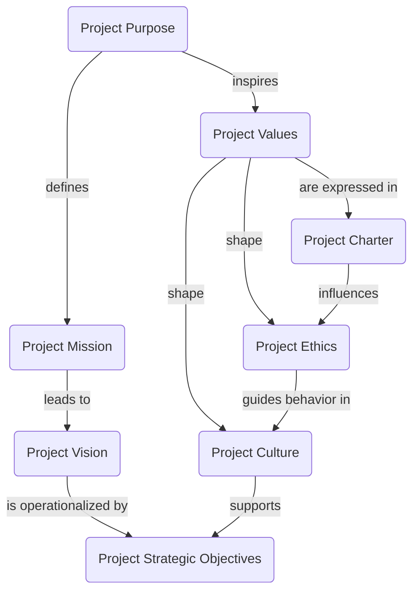

# Project foundation model

## Project purpose

Reduce tool-call waste and improve useful context-window utilization by planning bounded next-turn context packets from source-owned providers.

## Project mission

Provide Pi with a read-only planning and packing seam that can:

- inspect an objective and seeds;
- choose relevant providers with explicit budget caps;
- explain authority boundaries and non-authorizations;
- assemble context packets with provenance, omissions, and measurement receipts.

## Ownership boundary

This package owns:

- the `/context-pack` command;
- the `context_plan` model-callable tool;
- read-only `context_pack` packet assembly;
- provider planning/ranking/omission contracts.

This package does **not** own:

- SCI code semantics or patch planning;
- Markdown/docs authority;
- AGENTS loading semantics;
- AK task/decision/evidence lifecycle;
- FCOS board mutation or closeout;
- Prompt Vault mutation;
- git mutation;
- hidden policy enforcement from retrieved content.

## Scope boundary

- **Organization purpose** lives at org level and is documented in [Organization operating model](../org/operating_model.md).
- **Project purpose** is narrower: make context selection more deliberate, bounded, and evidence-bearing for Pi sessions.
