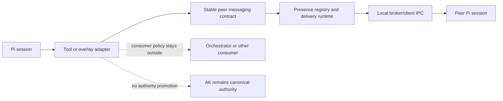
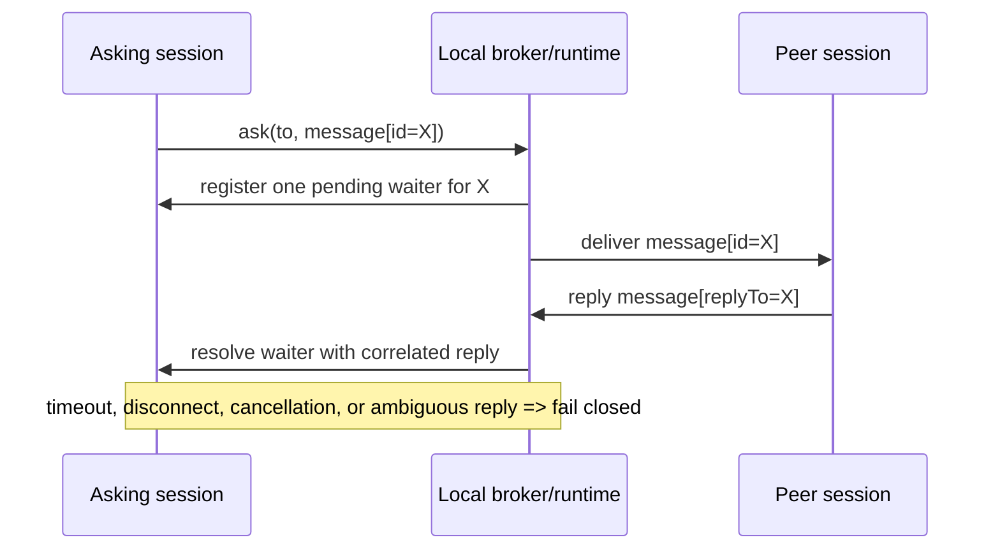

# RFC — peer-session messaging primitive

## Decision in one sentence

Create a **separate narrow package** for same-machine peer-session presence and direct `send` / `ask` messaging, with a small package-local messaging contract as the stable core and tool/UI/consumer policy treated as adapters.

## Scope

This RFC proposes a **separate narrow package** for local peer-session messaging derived from the useful parts of contrib `pi-intercom`.

In scope:

- local session presence
- broker/client IPC on one machine
- direct `send` / `ask`
- reply threading / reply hints
- minimal picker / compose UX where needed
- a package-local stable messaging contract that tool/UI can adapt to

Out of scope:

- canonical authority
- subagent execution/runtime behavior
- orchestrator workflow policy
- Prompt Vault semantics
- a generalized swarm or room abstraction
- cross-machine or network-first messaging

## Current boundary

Current owned reality is already:

- **AK** owns canonical authority/runtime truth
- **ASC** owns subagent execution/runtime behavior
- **`pi-society-orchestrator`** owns coordination/control-plane behavior above lower-plane owners
- **`pi-vault-client`** owns prompt-plane preparation and governance

Primary cross-packet boundary anchors:

- [`2026-04-22-subagent-contrib-salvage-boundary-status.md`](2026-04-22-subagent-contrib-salvage-boundary-status.md)
- [`2026-04-22-dual-salvage-packet-orchestrator-ux-and-peer-messaging.md`](2026-04-22-dual-salvage-packet-orchestrator-ux-and-peer-messaging.md)
- [`../../packages/pi-society-orchestrator/docs/project/2026-04-22-rfc-chain-parallel-worktree-ux-over-asc.md`](../../packages/pi-society-orchestrator/docs/project/2026-04-22-rfc-chain-parallel-worktree-ux-over-asc.md)

Interpretation rule:

This RFC does **not** reopen:

- whether messaging should live in ASC
- whether messaging should live in orchestrator by default
- whether peer messages can become canonical truth

It should not do any of those things.

## Problem framing

The owned stack currently lacks a clean owned primitive for **local peer-session communication between running Pi sessions**.

Contrib `pi-intercom` already proved that a useful minimal family exists:

- discover local peers
- send a direct message to one peer
- ask a peer and wait for a reply
- maintain a small presence model and local delivery transport

The missing step is to extract that concern into the owned stack **without** over-claiming what it is.

### Evidence backing the framing

High-signal evidence for that claim:

- contrib `pi-intercom` already implements a coherent same-machine direct-message model:
  - `/intercom` / `Alt+M` overlay flow
  - `intercom({ action: "list" | "send" | "ask" | "status" })`
  - local broker/client IPC with delivery and failure semantics
- the contrib code and types already expose the core semantic pieces:
  - `SessionInfo`
  - `Message`
  - attachment types
  - request/reply correlation
  - presence updates
- the contrib salvage review already classified this concern as **peer messaging**, separate from both execution kernel and coordination authority:
  - [`2026-04-22-subagent-contrib-salvage-boundary-status.md`](2026-04-22-subagent-contrib-salvage-boundary-status.md)

Primary evidence sources:

- `softwareco/contrib/pi-intercom/README.md`
- `softwareco/contrib/pi-intercom/index.ts`
- `softwareco/contrib/pi-intercom/types.ts`
- `softwareco/contrib/pi-intercom/broker/broker.ts`
- `softwareco/contrib/pi-intercom/broker/client.ts`
- `softwareco/contrib/pi-intercom/broker/framing.ts`
- `softwareco/contrib/pi-intercom/broker/paths.ts`
- `softwareco/contrib/pi-intercom/broker/spawn.ts`

### Evidence limits

There is still **insufficient evidence** for all of the following as first-slice requirements:

- room/squad/swarm semantics
- cross-machine networking
- rich coordination dashboard UX
- broad orchestration policy embedded in the transport layer
- attachment-heavy workflows beyond the current bounded direct-message use cases

That is why this RFC keeps the package narrow and local-first.

### Why current owned packages do not already solve this

ASC already owns execution/runtime for subagents.
Orchestrator already owns coordination/control-plane behavior.

Neither one currently owns a reusable same-machine peer-session communication primitive.

So this RFC is not duplicating either package.
It is proposing a **new primitive layer** that can later be consumed by higher-level packages without collapsing their ownership boundaries.

## What this primitive is

This primitive is:

- local session-to-session communication
- same-machine presence and delivery
- a convenience fabric for bounded coordination between live sessions

This primitive is **not**:

- AK authority
- society-state truth
- "Pi querying itself"
- the subagent execution kernel
- the orchestrator control plane

### Authority rule for messages and replies

Messages and replies are **communication only**.
They are never canonical operational state, evidence, or legal effect **by themselves**.

If a consumer later wants to turn a peer message into a durable decision, evidence record, or workflow transition, that consumer must do so through its own owned contract and the appropriate canonical authority surface, not through the messaging primitive alone.

## Existing useful behavior in contrib to preserve

The most important current `pi-intercom` properties worth preserving are:

- **1:1 direct-message bias** instead of room semantics
- **same-machine local IPC** instead of network transport
- **auto-spawned broker** rather than a separately managed daemon
- **reply correlation** that makes `ask` workable
- **runtime-only fallback aliasing** for unnamed sessions
- **minimal tool + minimal overlay** instead of a heavy dashboard

These are behavioral boundaries, not just implementation details.

## Prior art worth salvaging from contrib

The main useful prior art is not the contrib extension wholesale, but these concern slices:

- local broker/client split
- length-prefixed local IPC framing
- presence registration and listing
- `send` / `ask`
- reply matching and reply hints
- runtime-only fallback alias for unnamed sessions
- minimal UI affordances

## What should **not** be salvaged as target architecture

Do **not** carry forward these contrib assumptions as owned truth:

- peer messaging as a hidden control plane
- a transport package that embeds planner/worker workflow policy
- any implication that message traffic becomes canonical state authority
- a first slice that jumps straight to room/swarm abstractions
- coupling peer messaging to ASC or orchestrator package ownership by convenience

## Options considered

| Option | Description | Strengths | Risks / reasons not preferred |
|---|---|---|---|
| **A. Separate narrow local messaging package** **(preferred)** | Define a small package-local presence/message contract and implement same-machine broker/client delivery around it | Preserves owner boundaries, is testable, lets consumers add policy later, avoids monolith revival | Requires explicit contract definition and packaging discipline |
| B. Put peer messaging inside orchestrator | Treat messaging as part of control-plane coordination | Fewer packages at first glance | Couples transport to orchestration policy and makes reuse harder |
| C. Put peer messaging inside ASC | Treat messaging as adjacent to subagent runtime | Might feel convenient for delegated runs | Violates the execution/runtime boundary and conflates messaging with runtime ownership |
| D. Keep contrib `pi-intercom` as-is | Reuse the existing contrib package directly | Lowest immediate migration effort | Keeps owned stack dependent on contrib prior art rather than an owned narrow contract |
| E. Start with a network-ready or room-oriented fabric | Build a broader system from the start | Might anticipate future expansion | Insufficient evidence, much larger blast radius, loses the narrow direct-message bias |
| F. Keep current state and let consumers improvise local messaging ad hoc | No new package | Zero near-term cost | Repeats local glue and keeps a useful primitive unowned |

Preferred direction:

- choose **Option A** now
- explicitly reject **Options B/C/D/E** as first-slice target architecture
- reject **Option F** because it preserves avoidable drift

## Decision drivers

- preserve the already-landed AK / ASC / orchestrator ownership split
- recover same-machine peer-session communication without turning it into hidden authority
- keep the stable core smaller than any tool, overlay, or consumer policy helper
- preserve the direct-message bias that made contrib `pi-intercom` useful
- avoid coupling transport to orchestrator policy or ASC runtime semantics
- avoid premature expansion into room semantics, network transport, or heavy dashboard UX
- make rollback to the current no-owned-primitive state simple and truthful if the first slice proves wrong

## Architectural stance

This RFC takes a deliberately constrained stance derived from three competing architectural pressures:

1. **transport minimalism**
   - the first accepted surface should be the smallest same-machine messaging contract that can remain stable without smuggling in coordination policy or authority
2. **operator usability pressure**
   - a primitive that is too awkward to use will remain theoretically correct but practically irrelevant, so a thin tool surface and possibly a small overlay are legitimate adapters once the core is stable
3. **expansion restraint**
   - room semantics, network transport, richer attachments, or consumer-specific workflow helpers should not be assumed into the first slice just because the primitive feels adjacent to broader coordination work

The resulting stance is:

- establish a narrow same-machine messaging core now
- keep tool/UI surfaces clearly subordinate to that core
- keep consumer policy outside the package
- defer broader transport or collaboration semantics until real evidence proves the pressure

## Decision synthesis

This RFC was revised by forcing three strong but competing instincts into direct confrontation:

1. **boundary purism**
   - keep the primitive extremely small and refuse any hint of orchestration or authority leakage
2. **compatibility pragmatism**
   - preserve the operator-facing `intercom` shape where it materially lowers migration and adoption cost
3. **future-scale ambition**
   - avoid painting the stack into a corner if later collaboration pressure exceeds simple same-machine 1:1 messaging

The accepted synthesis is:

- side with **boundary purism** for the stable core
- side with **compatibility pragmatism** for the first public adapter
- reject **future-scale ambition** as a first-slice driver unless later evidence proves the primitive itself is the limiting layer

That synthesis is why this RFC keeps all three of the following true at once:

- the core stays same-machine and direct-message biased
- the first public surface remains `intercom`-compatible by default
- broader room/network/conversational coordination semantics are deferred to later explicit evidence and decision

## Why this direction beats the alternatives

### Why not put messaging inside orchestrator

Orchestrator owns coordination policy.
If messaging lands there first, transport and policy become harder to separate later, and reuse by other consumers becomes more awkward.

This RFC therefore keeps the primitive below orchestrator rather than inside it.

### Why not put messaging inside ASC

ASC owns execution/runtime for subagents.
Putting peer messaging there would blur the boundary between runtime ownership and session-to-session transport.

This RFC therefore keeps messaging out of ASC entirely.

### Why not keep contrib `pi-intercom` as the de facto answer

Contrib already proved the shape is useful, but leaving it there would preserve dependency on prior-art architecture rather than turning the concern into a narrow owned contract.

This RFC therefore treats contrib as evidence and salvage, not as the target home.

### Why not start with a broader room or network fabric

The current evidence supports direct same-machine messaging.
It does **not** yet support:

- room/swarm semantics
- cross-machine transport
- broad collaboration dashboards
- richer authority-bearing messaging workflows

So a broader fabric now would optimize for hypothetical future needs at the expense of a truthful first slice.

### Why not let consumers improvise messaging ad hoc

That would repeat the exact drift this RFC is trying to prevent:

- duplicated local delivery glue
- inconsistent request/reply semantics
- unclear addressing rules
- uneven treatment of unnamed sessions and delivery failure

The preferred direction instead creates one owned primitive while keeping it narrow.

## Preferred direction

## 1. Keep peer messaging in a separate package

Target shape:

- a new package in `pi-extensions`
- narrow charter: local peer-session messaging only

Why not orchestrator?

- orchestrator owns coordination policy, not the transport primitive itself

Why not ASC?

- ASC owns execution/runtime for subagents, not peer-session presence/messaging transport

## 2. Make the stable core a package-local messaging contract

The first truthful owned surface should be a **package-local messaging contract**.

Authority rule:

- the message/presence/runtime contract is the **stable core**
- tool names, overlays, compose views, and any later consumer-specific helpers are **adapters**
- no tool or UI name is the authority by itself

## 3. Preserve direct-message bias

The primitive should remain oriented around **targeted 1:1 local messaging**, not room semantics.

Core operations:

- list peers
- send message
- ask and await reply
- inspect connection/status

This preserves the narrowness that made `pi-intercom` useful.

## 4. Keep the broker local-first and same-machine only

The current useful property of the contrib design is its same-machine simplicity.
That should remain the default and chartered scope.

Bias:

- local IPC only
- no network/distributed fabric in the first owned slice
- no implicit cross-machine authority or transport story

## 5. Keep policy out of the transport package

The package may expose delivery semantics such as:

- direct send
- request/reply correlation
- reply hints
- simple presence fields

But it should **not** embed higher-level policy such as:

- when a delegated worker should escalate
- what completion handoffs mean
- whether a planner/worker pattern is appropriate

That policy belongs in consumers such as orchestrator.

## Stable core vs adapter boundary

### System map



### Stable core for this RFC

The stable core consists of:

1. a package-local `PeerPresence` contract
2. a package-local `PeerMessage` / `PeerAttachment` contract
3. same-machine broker/client delivery semantics
4. bounded `send` / `ask` / `status` semantics
5. request/reply correlation rules
6. runtime-only fallback addressing for unnamed sessions

### Adapters around the core

Adapters may include:

- one tool surface
- one minimal overlay/picker flow
- reply-hint rendering
- consumer-specific orchestration helpers in other packages
- compatibility naming adapters where explicitly chosen

Interpretation:

- adapters may change faster than the core
- adapters must not smuggle orchestration policy or authority into the transport layer

### Compatibility posture

| Surface | Role | Authority class |
|---|---|---|
| contrib `pi-intercom` | prior-art implementation and behavior reference | not owned authority |
| owned stable core | package-local presence/message/runtime contract | stable core |
| first external adapter | `intercom`-compatible tool adapter over the owned core | adapter, not authority |
| future consumer helpers | orchestrator- or product-specific policy helpers over the owned core | consumer adapter layer |

Interpretation:

- preserve `intercom` compatibility where it materially reduces adoption friction
- keep that compatibility at the adapter layer
- do not let the adapter name become the authority model
- treat the first `intercom`-compatible external adapter as the **default stable adapter posture** unless a later explicit compatibility decision says otherwise

### Compatibility matrix

| Concern | contrib `pi-intercom` | owned stable core | first owned external adapter |
|---|---|---|---|
| same-machine direct messaging | yes | yes | yes |
| package authority for transport semantics | no | yes | no |
| `intercom` naming | yes | no | yes |
| operator-facing overlay UX | yes | no | optional |
| orchestration policy | mixed usage in practice | no | no |

Interpretation:

- the owned package should preserve the useful operator-facing entrypoint shape where that reduces adoption friction
- but only the stable core owns the durable semantics contract

### Consumer boundary table

| Layer | Owns | Does not own |
|---|---|---|
| peer-session messaging core | presence, addressing, delivery, `send`, `ask`, reply correlation | orchestration policy, execution runtime, canonical authority |
| external adapter surface | tool/overlay ergonomics over the owned core | authority or consumer-specific workflow meaning |
| consumer packages | planner/worker policy, escalation meaning, workflow-specific messaging semantics | transport ownership |

Interpretation:

- consumers should usually consume the primitive directly first
- only introduce a higher-level helper layer if more than one real consumer proves the same policy abstraction is needed

### Adapter UX rule for addressing

When adapters render or select peers:

- always make session id targeting available
- prefer showing `name + short id` whenever ambiguity exists
- do not silently hide duplicate-name ambiguity behind best-effort routing
- preserve the distinction between a visible label and the canonical runtime id used for exact delivery

## Canonical messaging contract (decision-level)

The following contract is the decision-level core this RFC proposes.
The exact TypeScript names may vary, but the shape and ownership should not.

### Presence and message contracts

```ts
interface PeerPresence {
  id: string;
  name?: string;
  addressLabel: string;
  cwd: string;
  model: string;
  pid: number;
  startedAt: number;
  lastActivity: number;
  status?: string;
}

interface PeerAttachment {
  type: "file" | "snippet" | "context";
  name: string;
  content: string;
  language?: string;
}

interface PeerMessage {
  id: string;
  timestamp: number;
  replyTo?: string;
  content: {
    text: string;
    attachments?: PeerAttachment[];
  };
}
```

### Runtime operations

```ts
interface PeerMessagingRuntime {
  listPeers(): Promise<PeerPresence[]>;
  send(request: { to: string; message: PeerMessage }): Promise<DeliveryResult>;
  ask(request: { to: string; message: PeerMessage; timeoutMs?: number }): Promise<PeerMessage>;
  status(): Promise<PeerRuntimeStatus>;
}

interface DeliveryResult {
  delivered: boolean;
  messageId: string;
  reason?: string;
}

interface PeerRuntimeStatus {
  connected: boolean;
  selfId?: string;
  activePeerCount: number;
}
```

### Contract rules

- the first slice is intentionally **same-machine only**
- delivery targets may be resolved by session id or current address label
- unnamed sessions may expose a runtime-only fallback address label
- `ask` requires request/reply correlation and bounded timeout behavior
- only **one in-flight `ask` per local session** is part of the first accepted contract
- the package should fail clearly on delivery failure instead of inventing success
- the package should not imply message durability beyond the live session/broker scope unless a later RFC explicitly expands that contract
- message delivery or reply receipt does **not** itself create canonical state, evidence, or workflow completion

### Address resolution rules

For the first accepted contract:

- explicit **session id wins** over name-like addressing
- if multiple peers share the same visible name, name-based resolution must **fail closed** and require id targeting
- adapters should surface that ambiguity clearly by presenting the conflicting peers with short ids and requiring an exact selection path
- the runtime fallback alias for unnamed sessions is **addressability-only**
- that fallback alias is **non-persistent** and must not become the stored Pi session title by convenience

### `ask` semantics

For the first accepted contract:

- the runtime exposes a **documented bounded default timeout**
- the initial recommended package default is **10 minutes** to match current contrib behavior and reduce migration surprise
- if that default changes later, treat it as an explicit compatibility decision rather than silent drift
- the runtime must register one waiter for the pending request and match replies by explicit correlation (`replyTo` / originating message id)
- cancellation, disconnect, timeout, or ambiguous correlation must **fail closed**
- `ask(...)` returns the correlated reply message as communication output, not as canonical state mutation

### Attachments boundary

For the first accepted boundary:

- attachments are **optional**
- if supported, they stay limited to the bounded current types: `file`, `snippet`, `context`
- richer attachment semantics are explicitly deferred until usage pressure proves they matter

## Minimal worked examples

### Example A — list peers

```ts
{
  action: "list"
}
```

Expected outcome:

- returns visible same-machine peers
- excludes authority claims
- reports current addressability rather than every open Pi process on the machine

### Example B — direct ask

```ts
{
  action: "ask",
  to: "planner",
  message: "Should I optimize this for readability or throughput first?"
}
```

Expected outcome:

- sends one direct message
- waits for a bounded correlated reply
- returns the reply as communication, not as canonical state mutation

### Example C — `ask` sequence



### Example D — duplicate-name disambiguation in adapter UX

Expected adapter behavior when two peers share the same visible name:

```text
Select target session:
- planner (7f2a1c9d) — ~/repo-a
- planner (c314e8b2) — ~/repo-b
```

Interpretation:

- the adapter should not silently pick one `planner`
- it should present an exact disambiguation path using `name + short id`
- the runtime should still treat the session id as the canonical exact delivery target

## Proposed implementation order

## Slice A — transport + presence kernel

Minimum owned package surface:

- broker spawn/reconnect
- presence register/unregister
- list peers
- send direct message
- ask/reply correlation
- delivery failure reporting
- bounded same-machine addressing semantics

### Package-facing contract for Slice A

- package-local stable core: presence/message/runtime contract
- **recommended first adapter surface:** one package-local messaging tool/runtime entrypoint as the single authority-facing adapter
- no UI is required in Slice A

Interpretation:

- tool name is not authority
- the runtime/tool contract is the adapter boundary tests should target first

## Slice B — thin tool and minimal overlay surface

Then expose the primitive through a narrow Pi-facing surface such as:

- one tool for `list` / `send` / `ask` / `status`
- one small overlay or picker/compose flow
- reply-hint rendering only if it continues to serve the core direct-message semantics

Documentation rule for this slice:

- the package README and operator docs should describe the runtime/tool contract first
- any overlay or picker UX should be documented as an optional adapter over that core rather than as the primary authority surface
- the eventual package README should explicitly separate:
  - stable runtime/tool contract
  - optional overlay or picker UX
  - consumer-specific helpers that live outside this package

## Slice C — consumer integration hooks

Only after the primitive is stable should consumers add their own policy layers above it.

Example consumer behavior that stays **outside** the primitive:

- orchestrator deciding when a delegated worker should ask upstream
- builder/manager UX that routes through peer messaging
- workflow-specific message templates
- package-specific escalation rules

## Migration and rollback

## Migration plan

| Phase | Change | Compatibility posture |
|---|---|---|
| 0 | Freeze current boundary assumptions and treat contrib `pi-intercom` as prior art rather than owned authority | no user-facing behavior change |
| 1 | Land the stable presence/message/runtime core | additive; no requirement to ship overlay yet |
| 2 | Add one tool surface and optionally one minimal overlay | additive; transport contract remains the stable core |
| 3 | Reassess whether consumer-specific policy adapters are justified | no promise to proceed |
| 4 | If later useful, add explicit compat adapters or consumer hooks | adapter-only, not authority shift |

## Rollback plan

If Slice A or B proves wrong:

- remove or disable the new package adapters
- leave AK, ASC, and orchestrator boundaries untouched
- do not preserve failed UI or tool naming decisions as authority artifacts
- keep contrib `pi-intercom` as prior art only, not fallback owned truth

Rollback success condition:

- the stack returns cleanly to the current owned boundary without peer messaging collapsing into orchestrator or ASC

## ADR acceptance criteria to carry forward

If this RFC is accepted as ADR basis, the ADR should carry forward at least these concrete acceptance criteria:

- `ask` has bounded timeout behavior with a documented default
- the initial default timeout is explicitly documented rather than implied by code or contrib memory alone
- `ask` reply correlation is explicit and fail-closed on ambiguity, disconnect, timeout, or cancellation
- duplicate visible names fail closed for name-based delivery and require id targeting
- adapters surface duplicate-name ambiguity with `name + short id` style presentation and require an exact targeting path
- runtime fallback aliases for unnamed sessions remain non-persistent and addressability-only
- the first stable primitive contract keeps one in-flight `ask` per local session unless a later explicit decision changes that rule
- message delivery and reply receipt never count as canonical state, evidence, or workflow completion by convenience

## Validation matrix

This RFC should not be treated as successful based on prose confidence alone.
Validation must be executable.

| Validation concern | Expected proof shape |
|---|---|
| presence contract shape stays narrow and explicit | package-local contract tests |
| same-machine broker/client path is deterministic | path and spawn tests |
| registration and listing stay bounded | presence registration/listing tests |
| duplicate names and id targeting behave clearly | targeting-resolution tests |
| unnamed-session fallback aliasing is stable and non-persistent | runtime identity tests |
| `send` reports delivery and failure clearly | delivery acknowledgement tests |
| `ask` correlation is truthful | request/reply matching tests with timeout behavior |
| reconnect/auto-spawn behavior is bounded | broker restart/reconnect tests |
| docs and examples match rendered behavior | docs validation + targeted adapter tests |
| packaged behavior remains truthful if a tool/overlay ships | package `check` / release-check once the package exists |

### Minimum named validation anchors expected before ADR follow-through is considered complete

- package-local contract tests for presence/message/runtime shapes
- local IPC framing and path tests
- broker auto-spawn/reconnect tests
- request/reply correlation tests for `ask`
- `ask` timeout / cancellation / disconnect fail-closed tests
- duplicate-name / fallback-address resolution tests
- docs strict validation
- package `check`

## Explicit non-goals

This RFC does **not** propose:

- making peer messaging canonical authority
- making peer messaging part of ASC
- making peer messaging part of orchestrator by default
- adding group chat / swarm semantics in the first slice
- replacing AK, Prompt Vault, or orchestrator decisions with chat messages
- making networked or cross-machine transport part of the first accepted contract

## Guardrails

1. **No authority drift**
   - messages are communication, not canonical truth
2. **No execution-kernel drift**
   - do not absorb subagent runtime behavior into the messaging package
3. **No control-plane drift**
   - do not hide orchestration policy inside broker/client code
4. **No network creep in the first owned slice**
   - keep same-machine local IPC as the chartered scope
5. **No "Pi querying itself" framing**
   - this is peer-session communication, not a self-authority mechanism
6. **No consumer-policy leakage**
   - planner/worker and workflow policy stays in consumers, not in this package
7. **No primitive widening for consumer convenience alone**
   - if richer coordination semantics are needed, they should usually land in a higher-level package first rather than broadening the primitive automatically

## Relationship to sibling packet

This primitive is designed to be consumed later by higher-level coordination UX when appropriate, but it should not be a prerequisite for the first orchestrator-native chain/parallel/worktree slice.

Sibling RFC:

- [`../../packages/pi-society-orchestrator/docs/project/2026-04-22-rfc-chain-parallel-worktree-ux-over-asc.md`](../../packages/pi-society-orchestrator/docs/project/2026-04-22-rfc-chain-parallel-worktree-ux-over-asc.md)

Interpretation:

- orchestrator may later consume this primitive
- the primitive should still make sense on its own

## Provisional answers to common reviewer questions

This revision closes several likely reviewer questions enough to keep the ADR scope bounded.

### Should the first slice include UI?

Recommended answer for this RFC:

- no
- Slice A should prioritize the transport/presence core first
- a minimal overlay is optional in Slice B, not a prerequisite for the stable contract

### Should the first user-facing adapter be one tool or multiple wrappers?

Recommended answer for this RFC:

- one package-local messaging tool/runtime entrypoint first
- preserve an **`intercom`-compatible first external adapter name** because it materially reduces adoption friction
- optional command/overlay wrappers should remain thin adapters over that same core rather than second authority surfaces

### Are attachments required in the first accepted direction?

Recommended answer for this RFC:

- attachments are optional in the first contract
- if present, keep only the currently bounded attachment types
- richer attachment semantics are not first-slice requirements

### Is network or cross-machine transport part of this direction?

Recommended answer for this RFC:

- no
- the first accepted contract is intentionally same-machine only

### Is orchestration policy part of this package?

Recommended answer for this RFC:

- no
- consumer policy belongs in packages such as orchestrator, not in the messaging primitive

### Is one pending `ask` per local session part of the first accepted contract?

Recommended answer for this RFC:

- yes
- it is part of the **first stable primitive contract**, not merely an implementation detail
- the first slice should keep one in-flight `ask` per local session as a bounded simplicity rule
- broader concurrency for correlated conversational request sets is deferred until real pressure proves it is needed

### What happens when two peers share the same visible name?

Recommended answer for this RFC:

- explicit session id targeting wins
- name-based delivery in that case must fail closed
- adapters should render the ambiguous peers with `name + short id` style disambiguation
- callers should be pushed toward exact id targeting or exact selection rather than silent best-effort guessing

### Is the unnamed-session fallback alias persistent?

Recommended answer for this RFC:

- no
- it is runtime-only and addressability-only
- it must not overwrite the stored Pi session title by convenience

### Is the `intercom`-compatible first external adapter intended to be long-term stable?

Recommended answer for this RFC:

- yes, by default
- preserve `intercom` compatibility as the first stable external adapter unless a later explicit compatibility decision justifies a different name
- any rename or split should require a deliberate compatibility and migration plan rather than silent drift
- reviewers should assume stability of that adapter unless a later ADR or compatibility note says otherwise

### If richer coordination semantics are later needed, should they widen this primitive?

Recommended answer for this RFC:

- usually no
- richer coordination semantics should default to a higher-level package above this primitive
- widen the primitive itself only if the direct same-machine messaging core is proven insufficient on its own

### Should a consumer-facing orchestration helper package be added above this primitive?

Recommended answer for this RFC:

- not by default
- direct consumption by orchestrator is sufficient until more than one real consumer proves the same higher-order policy abstraction is needed
- if such a helper appears later, it should remain clearly above this primitive rather than broadening the primitive itself

### What minimum evidence would justify expansion beyond same-machine direct messaging?

Recommended answer for this RFC:

- more than one real consumer materially blocked by the same-machine boundary
- a clear identity/security model for broader transport
- proof that the authority boundary remains intact
- executable validation for the widened transport model before any broadening lands
- clear evidence that the primitive itself, not merely one consumer's policy needs, is the limiting layer

## Open decision questions that remain real

This revision intentionally closes many earlier reviewer questions, but the following **follow-on decision questions** remain real and should not be smuggled into the ADR unnoticed:

1. **After Slice A/B, is there enough real usage pressure to justify attachments beyond the current bounded types?**
2. **If future pressure demands more than one in-flight `ask` per session, is that best handled by widening this primitive or by building a higher-level conversational coordination layer above it?**
3. **Once the core is proven, is there enough operator evidence to justify shipping the minimal overlay in the same package rather than leaving the tool/runtime surface as the only adapter?**

## Bottom line

The right owned salvage from contrib `pi-intercom` is a **separate narrow local peer-session messaging primitive**.

It should preserve what was actually useful:

- broker/client presence
- direct local messaging
- `ask` / reply behavior
- bounded same-machine delivery

while explicitly refusing to become:

- execution runtime
- coordination authority
- AK truth
- a hidden replacement for the rest of the owned stack
