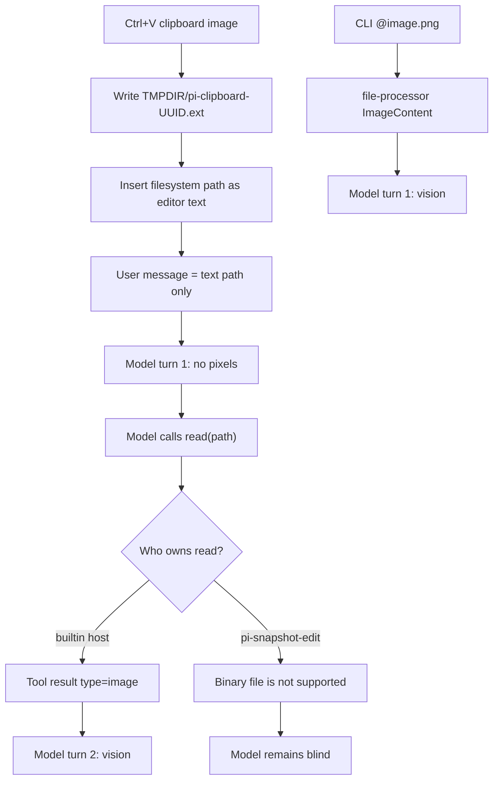

# RFC: Harnessed LLM vision authority

## Decision requested

Adopt this split and stop treating vision as a `read` feature:

1. **User-visible images are host multimodal content.** Paste, `@file`, and drag must become `content[].type = "image"` before the first model turn.
2. **`pi-snapshot-edit` remains text-mutation authority.** Image bytes are not snapshots, have no revision aliases, and must not enter the snapshot store.
3. **Standard-tool replacement is a compatibility class, not a total takeover.** Replacing host `read` without preserving or retiring the host image contract is unlawful.
4. **Local carriers may lift clipboard paths through the host `input` transform.** They must not grow a second filesystem or a second image pipeline.

Do not ship a snapshot-edit "image read" quick fix. Do not treat `PI_SNAPSHOT_EDIT_OVERRIDE=0` as the architecture.

The operator screenshot that exposed this gap is the mode-seeking infographic. Durable copy and harness application: [Mode-seeking harness RFC](2026-09-01-harnessed-llm-mode-seeking-rfc.md).

## Observed failure (this session)

Live session `01a05a29-919f-7283-a59a-6ec6cd1384da` on grok-4.6:

1. Operator pasted a screenshot. The user message stored **text containing a path**:
   `/home/tryinget/.local/state/pi-quests/tmp/pi-clipboard-<uuid>.png`
2. No `content[].type = "image"` block was present on the user message.
3. The model called `read` on that path.
4. `read` returned `Binary file is not supported: <path>`.
5. The model never received pixels. OCR was not installed. The operator asked why image skills were unused.

This is not a model-capability miss. Grok 4.6 accepts images. The harness dropped them.

## Current architecture (as implemented)



### Host paste is pathification by design

In `softwareco/contrib/pi-mono` `packages/coding-agent/src/modes/interactive/interactive-mode.ts`:

- Comment: "Images are attached by path".
- `handleClipboardPaste()` writes `pi-clipboard-${uuid}.${ext}` under `os.tmpdir()` and inserts the path with `insertTextAtCursor`.
- Subsequent interactive `session.prompt(text)` calls **do not** pass `images`.
- `TMPDIR` in this environment is `~/.local/state/pi-quests/tmp`, which is why the paths look quest-owned. They are host paste files landing in the process tmpdir.

### Host already has a true attachment path

CLI `@file` goes through `cli/file-processor.ts`: sniff mime, `processImage()`, emit `{ type: "image", mimeType, data }` plus a `<file name="...">` text marker. `main.ts` passes those as `fileImages` into the initial prompt.

Builtin `read` (`core/tools/read.ts`) is the **interactive** vision bridge:

- description: "Supports text files and images ... Images are sent as attachments."
- sniff via `ops.detectImageMimeType`
- `ops.readFile` + `processImage`
- return image content blocks
- honor `blockImages` / non-vision models with an explicit note

Host also already normalizes **tool-result** images after extension `tool_result` hooks (`agent-session.ts`).

### Snapshot-edit cut the interactive bridge on purpose

`pi-snapshot-edit` replaces builtin `read`/`edit` at `session_start` by default (ADR 0001, Protocol B).

The replacement:

- opens the file as local bytes
- decodes UTF-8
- fail-closes on null bytes: `Binary file is not supported`
- snapshots text into a revision store
- returns `revision:<alias>` plus raw text

There is an explicit regression test:

`standard read override fails closed for images instead of bypassing host authority`

The original invariant, from 2026-07-11 dogfood, was:

> Unsupported standard reads must fail closed rather than constructing a local reader that could bypass a remote or sandbox owner.

That invariant is about **authority**, not about making harnessed LLMs blind. The test encoded the wrong operational conclusion: "never return images" instead of "never open image bytes through a different authority path than the host would."

The dogfood note already admits the package is a **reversible local carrier**, and that remote/sandbox operation adapters belong in Pi core. Snapshot-edit already does not preserve remote read adapters for text. Fail-closing images does not restore that authority; it only destroys the remaining vision fallback.

## Problem framing

Two independent contracts were collapsed into one tool name.

| Contract | Host owner today | Snapshot-edit today | Required for vision |
|---|---|---|---|
| UTF-8 snapshot read + revision alias | builtin `read` (text, gutters) | Protocol B `read` | no |
| Exact-selector text mutation | builtin `edit` | Protocol B `edit` | no |
| User-message image parts | CLI `@file` only | none | **yes, primary** |
| Tool-result image parts | builtin `read` image branch | fail-closed | fallback only |
| Clipboard paste | path insert into editor | none | must become user-message image parts |

The illegal combination is:

- host interactive paste still depends on `read` as the vision bridge
- snapshot-edit `read` is text-only by test
- no `input` / submit lift converts `pi-clipboard-*` paths into image parts

Operator-visible symptom: "why didn't you just look at the image?"

## Owner and authority matrix

| Concern | Canonical owner | Must not become |
|---|---|---|
| Clipboard image bytes, mime sniff, `processImage`, provider image parts | Pi host (`contrib/pi-mono` coding-agent) | snapshot store, OCR, Prompt Vault |
| Interactive paste/submit attachment | Pi host TUI | a path the model is hoped to `read` |
| CLI `@file` image attachment | Pi host CLI file-processor | a second interactive pipeline |
| Standard `read`/`edit` replacement for text snapshots | `pi-snapshot-edit` | image authority |
| Local reversible carrier that lifts clipboard paths on `input` | `pi-extensions` (see options) | a new filesystem, a new mime stack, or AK |
| Host compatibility proof | pi-extensions root canary | package-local folklore |
| Task/decision/evidence | AK | this RFC |
| Reusable procedure text | Prompt Vault | runtime truth |

Seven-field owner-handoff:

1. **Source owner:** Pi host for multimodal content; `pi-snapshot-edit` for text snapshot mutation; pi-extensions root for the replacement compatibility contract and canary.
2. **Native fact:** user/tool messages may contain `ImageContent`; snapshot revisions are UTF-8 text only.
3. **AK fact:** none until this RFC is accepted; no runtime/schema change is required to state the contract.
4. **Projection boundary:** this RFC is narrative/design; live tool owners are the running Pi process after install/reload.
5. **Mutation gate:** no code until ADR or explicit AK task. Host paste changes live in contrib/pi-mono; snapshot-edit ADR 0001 amendment lives in that package; canary binding lives at repo root.
6. **Non-authorizations:** do not treat OCR, bash `file`/`identify`, or "just cat the png" as vision. Do not promote session JSONL to capability truth. Do not let snapshot-edit invent remote/sandbox image adapters.
7. **Validation surface:** host canary plus a live one-shot Pi session that proves image parts reached the model, not that a PNG existed on disk.

## Options

### A. Emergency opt-out only

`PI_SNAPSHOT_EDIT_OVERRIDE=0` restores host `read`.

- Restores the **two-turn** path: paste path -> model calls `read` -> image tool result.
- Does not attach images on turn 1.
- Does not fix paste-as-path.
- Sacrifices Protocol B standard-tool dogfood.
- Acceptable as a local operator workaround, not an architecture.

### B. Image branch inside snapshot-edit `read`

Sniff PNG/JPEG/WebP/GIF/BMP in the replacement `read`; return host-shaped image blocks; do not snapshot.

- Restores the current host fallback without waiting on contrib.
- Keeps two-turn latency and the model's need to guess that a path is an image.
- Reimplements host `processImage` / mime sniff, or imports host internals.
- Recreates the original "bypass host authority" risk unless it uses the host operations adapter, which snapshot-edit does not have.
- Mixes snapshot revision semantics with binary attachments in one tool.
- **Reject as target.** Wrong owner. Turns a text-mutation package into a second vision stack.

### C. Extension `input` lift (local carrier)

Host already has `pi.on("input")` with `{ action: "transform", text, images }`. A carrier can:

1. Detect conservative image-path tokens in submitted text (`pi-clipboard-*` under tmpdir, and/or explicit `@image` tokens).
2. Sniff mime and load bytes through the same host utilities the CLI file-processor uses, or fail closed.
3. Attach `ImageContent` so turn 1 is multimodal.
4. Leave a `<file name="...">` marker, matching CLI.
5. Never create a snapshot revision.

Lawful because it uses the host input-transform contract instead of impersonating `read`.

Risks:

- Over-lifting arbitrary `.png` paths in prose sends unexpected bytes to the provider.
- Under-lifting (only exact `pi-clipboard-*`) misses drag/drop and hand-typed `@screenshot.png` in TUI.
- Carrier ownership: stuffing this into snapshot-edit couples vision to an editor. A dedicated small package or a host-owned path is cleaner.

**Accept as transitional local carrier**, with a conservative allowlist, until D lands.

### D. Host paste/submit first-class attachment (target)

Change interactive paste/submit so it shares the CLI attachment contract:

- Path may remain a human-visible placeholder in the editor.
- `session.prompt(text, { images })` must include processed image parts.
- Builtin `read` image support remains for files the model opens later.
- Snapshot-edit can stay text-only; the fail-closed image test becomes correct.

This is the only option that makes "look at this screenshot" a one-turn, extension-proof, harnessed-LLM behavior.

Requires contrib/pi-mono work. pi-extensions cannot claim it as completed by writing an RFC.

### E. Stop replacing `read`; replace only `edit`

Protocol B token-lean reads go back to `snapshot_read`. Standard `read` stays host, including images.

- Restores fallback vision immediately.
- Splits the model's read surface again (`read` vs `snapshot_read`).
- Conflicts with the default-replacement dogfood that ADR 0001 adopted.

**Accept as a fallback if D is delayed and C is rejected.** Not the target.

## Preferred direction

**Target: D in pi-mono later. Transitional carrier C is accepted in pi-extensions now.** Reject B as architecture. Keep A as operator emergency only. Keep E as a documented fallback.

Carrier C lands in `pi-snapshot-edit` as a sibling `input` module, not as snapshot `read` image support and not as a pi-mono paste change. That package is the live install unit that replaced host `read`. See [ADR 0002](../../packages/pi-snapshot-edit/docs/adr/0002-clipboard-image-lift.md).

Stable core:

- Image bytes are `ImageContent` on user messages or tool results.
- Snapshot revisions are UTF-8 text plus digest/identity.
- Those stores do not mix.

Adapter boundary:

- Host owns mime sniff, resize/convert, provider serialization, `blockImages`, and non-vision notes.
- Extensions may *attach* or *replace* image parts through `input` / `before_agent_start` / `tool_result`.
- Extensions may not decode images as snapshot text.

Compatibility class for any standard `read` replacement:

| Class | Meaning | Lawful when |
|---|---|---|
| `text-only` | UTF-8 fail-closed on binary | host paste/submit already attaches images, or replacement is namespaced-only |
| `host-image-compatible` | returns the same image blocks as builtin `read` | replacement remains the interactive vision fallback |
| `authority-preserving-delegate` | image branch uses host `operations` (`access`, `readFile`, `detectImageMimeType`) | remote/sandbox read owners exist |

Default replacement remains `text-only` for `read`. Carrier C makes that class lawful for host clipboard paste by attaching images on `input` instead of teaching snapshot `read` to decode pixels.

## Contracts

### C1. User-message image contract

A submitted operator image must produce at least one `ImageContent` block on the user message **before** the first provider call, unless:

- the model `input` does not include `"image"`, in which case the host already emits a non-vision note, or
- `blockImages` is true.

Text may still contain the path or `<file name="...">`. Text is not a substitute for the image block.

### C2. Paste placeholder contract

`pi-clipboard-<uuid>.<ext>` under `os.tmpdir()` is an editor placeholder, not model-visible proof of vision. Submit must lift it. The file is scratch; it is not an AK artifact, not a quest resource, and not a snapshot.

### C3. Snapshot exclusion contract

`SnapshotStore` admits UTF-8 text only. Image bytes:

- do not get `revision:` aliases
- do not get exact-selector edits
- do not get paginated as text

If a path sniffs as a supported image, snapshot `read` must not attempt UTF-8 decode. Under target D, it should not be asked. Under transitional C, `read` may still fail closed.

### C4. Standard-tool replacement contract

Replacing builtin `read` requires an explicit compatibility class (table above) recorded in package ADR and proven by canary. Silent text-only takeover of a multimodal host tool is a host-contract break.

### C5. Conservative lift allowlist (carrier C)

If a local `input` transform lifts paths, it may only lift:

1. `pi-clipboard-*` files under the process tmpdir that sniff as supported still images, and
2. explicit `@path` tokens that sniff as supported still images (parity with CLI).

It must not lift:

- arbitrary `.png` substrings in prose
- animated PNG / unsupported binary
- paths that fail access/sniff
- images when `blockImages` is set

Failed lift must leave the path in text and must not invent OCR.

### C6. Canary contract

Root host-compatibility canary currently has **no** vision/read-override scenario. Required proofs:

1. **Host builtin:** `read` on a PNG returns `type=image` content.
2. **Snapshot override:** with default replacement active, a `pi-clipboard-*.png` submit results in user-message image content **or** a documented fail-closed class plus a passing carrier lift.
3. **Negative:** UTF-8 snapshot `read` on a PNG still does not create a revision.

Proof is session JSONL / tool-result content shape, not "the file exists."

## Migration and rollback

Phase 0 — contract only (this RFC). No code.

Phase 1 — ADR amendment in `pi-snapshot-edit`: Protocol B `read` is text-only; images are outside snapshot authority; default replacement is lawful only with C or D.

Phase 2 — local carrier C in pi-extensions, install/reload, live proof. Prefer a dedicated small package or a host-adjacent helper over growing snapshot-edit. Exact package placement is an open question below.

Phase 3 — contrib/pi-mono D: interactive paste/submit shares file-processor attachment. Carrier C becomes redundant and can be disabled.

Phase 4 — canary scenarios land in `policy/pi-host-compatibility-canary.json` before claiming D done.

Rollback:

- Disable carrier C without touching snapshot-edit.
- `PI_SNAPSHOT_EDIT_OVERRIDE=0` restores host `read` fallback.
- Uninstalling snapshot-edit restores builtin tools.

No AK runtime/schema change is required.

## Validation

Machine-checkable:

- User message after paste-submit contains `content` entry `{ type: "image", mimeType, data }`.
- Snapshot store has no revision for that PNG.
- Default snapshot-edit replacement still round-trips a UTF-8 edit.
- Canary fails if replacement is `text-only` and no lift occurred.

Live-runtime proof (required before any "vision works" claim):

```text
pi -e <carrier-or-host-build> -p '<prompt>' with a real PNG attachment
```

Interactive TUI paste must also be proven in Ghostty; print-mode `@file` is not a substitute for Ctrl+V.

## Open questions (decision-grade)

1. **Carrier ownership:** resolved for this wave — sibling module in `pi-snapshot-edit`, not `pi-little-helpers` and not a new package. Revisit if the lift outgrows text-mutation ownership.
2. **Allowlist width:** clipboard-tmp only for this wave, or later TUI `@image` parity with CLI?
3. **Should interactive editor keep inserting paths at all?** Target D can keep them as placeholders; it must not rely on the model to `read` them.
4. **Remote/sandbox `read` owners:** if those land in host, image lift must use host operations. Local carrier must fail closed rather than open a second FS.
5. **Upstream vs local first:** wait for contrib D, or ship C now as a reversible carrier? Recommendation: C now, D as the durable host fix.
6. **Does ADR 0001 default replacement remain justified** once `read` is no longer a total host clone? Recommendation: yes for text, only with C or D in place.

## Non-goals

- OCR as a vision substitute
- Teaching models to `bash`/`python` decode PNGs
- Putting image bytes in Prompt Vault, AK, or diary
- Making snapshot-edit a general binary reader
- Changing provider vision APIs
- Claiming the unseen operator screenshot's subject was understood

## Concern Packet Manifest v0

```yaml
concern_title: harnessed-llm-vision-authority
packet_mode: contract_first
authority_landing: docs_only
docs_direction_impact: none
first_binding_required: ADR 0002 plus clipboard-image-attach tests; host D remains a later contrib task
evidence_obligations:
  - live session JSONL showed path-only user content and Binary file is not supported
  - host paste writes pi-clipboard-* under os.tmpdir and prompts without images
  - host CLI @file and builtin read already emit ImageContent
  - snapshot-edit tests require image fail-closed
compression_target: this RFC
knowledge_landing: docs_only
prompt_vault_follow_on: none
```

### Why this landing is truthful

- Owner split is host multimodal content vs snapshot text mutation. That split is missing from ADR 0001.
- Not `execution_first`: any code now would pick B or a paste hack without a compatibility class.
- Not a runtime/schema concern: AK does not need to store image parts for the contract to exist.
- Upstream routed concern preserved: "make pasted screenshots real for harnessed LLMs" after proving the custom `read` override is in the path.

### Exact next move

Review this RFC (three lenses: host multimodal contract, snapshot-edit authority, canary/testability). Then either:

- amend ADR 0001 and open an AK task for carrier C, or
- reject C and wait on contrib D with an explicit `text-only` + path-paste risk acceptance.

### AK runtime/schema decision now

- `runtime_schema_change_needed_now: no`
- No missing canonical AK fact. Vision content is a Pi message contract.

## References

- Host paste: `contrib/pi-mono/packages/coding-agent/src/modes/interactive/interactive-mode.ts` (`handleClipboardPaste`)
- Host CLI attach: `contrib/pi-mono/packages/coding-agent/src/cli/file-processor.ts`
- Host read images: `contrib/pi-mono/packages/coding-agent/src/core/tools/read.ts`
- Host input transform: `contrib/pi-mono/packages/coding-agent/src/core/extensions/types.ts` (`InputEventResult`)
- Snapshot fail-closed: `packages/pi-snapshot-edit/src/text-file.js`, `packages/pi-snapshot-edit/tests/extension.test.js`
- ADR 0001: `packages/pi-snapshot-edit/docs/adr/0001-snapshot-bound-line-range-editing.md`
- Dogfood: `packages/pi-snapshot-edit/docs/project/2026-07-11-standard-override-dogfood.md`
- Canary: `docs/project/pi-host-compatibility-canary.md`
