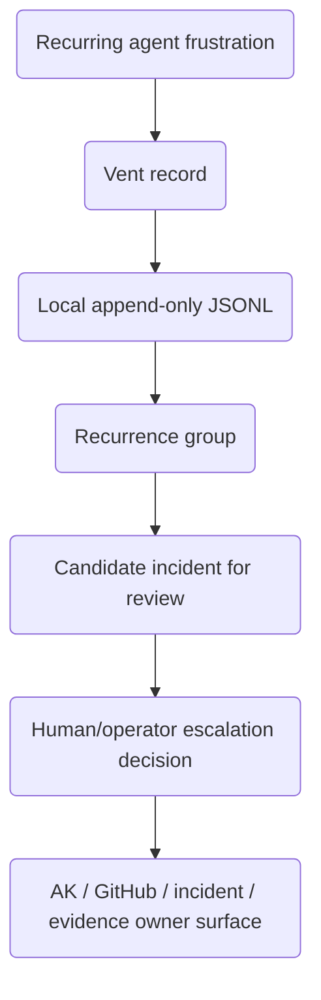

# Project foundation model

## Purpose

Capture recurring agent-observed friction as local diagnostic events so maintainers can see patterns that ordinary final answers hide.

## Scope boundary

In scope:

- Pi custom tool `agent_vent`.
- Pi command `/agent_vent` with `/agent-vent` compatibility alias.
- Local JSONL append/read/summarize behavior.
- Redaction/minimization and candidate-incident heuristics.

Out of scope for v0.1:

- Creating AK tasks, GitHub issues, canonical evidence, or real incidents.
- Remote telemetry or team sync.
- Dashboard/UI beyond text command/tool output.
- Automatic deletion/retention policy beyond documented store path and operator-managed files.

## Vocabulary

- **Vent record:** one local diagnostic event.
- **Recurrence group:** local grouping by recurrence key.
- **Candidate incident:** high/repeated local pattern worth human review.
- **Canonical incident/task/evidence:** external owner-surface fact, never created by this package in v0.1.
