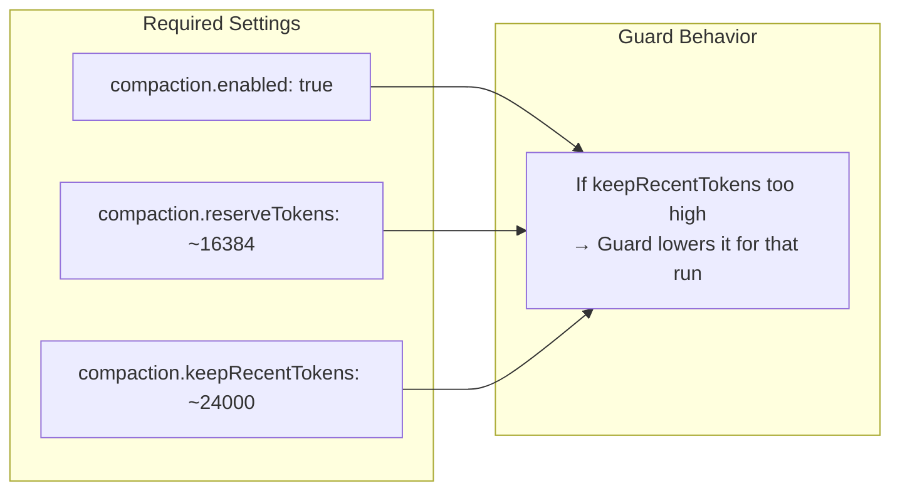
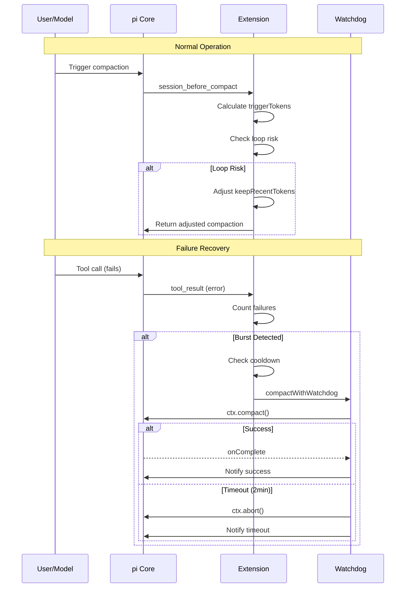

# Compaction Configuration

Part of [[custom-compaction-architecture|Custom Compaction Architecture]].

---

## Configuration Requirements

The extension expects these compaction settings in `~/.pi/agent/settings.json`:

```json
{
  "compaction": {
    "enabled": true,
    "reserveTokens": 16384,
    "keepRecentTokens": 24000
  }
}
```

| Setting | Recommended | Purpose |
|---------|-------------|---------|
| `enabled` | `true` | Enable auto-compaction |
| `reserveTokens` | ~16384 | Tokens reserved for LLM response |
| `keepRecentTokens` | ~24000 | Recent tokens to keep (guard adjusts if too high) |



---

## Complete Event Flow



---

## See Also

- [[compaction-guard|Compaction Guard]] - Loop-risk interception
- [[failure-recovery-compaction|Failure Recovery]] - Automatic recovery triggers
- [[compaction-helpers|Compaction Helpers]] - Instructions and API discovery
