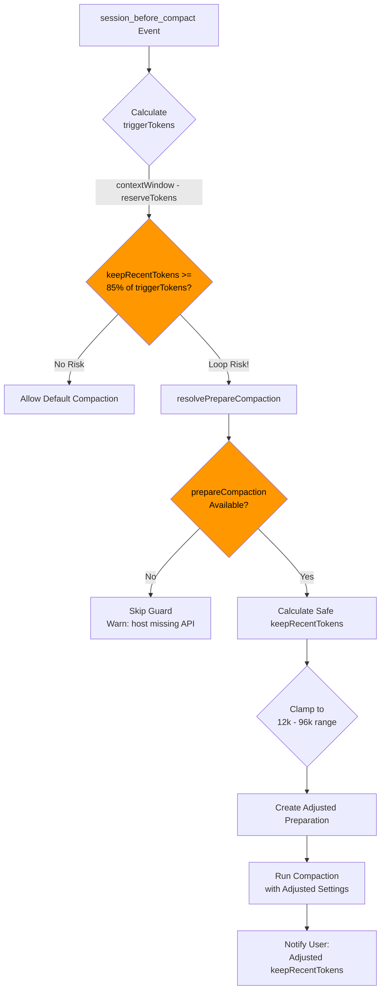
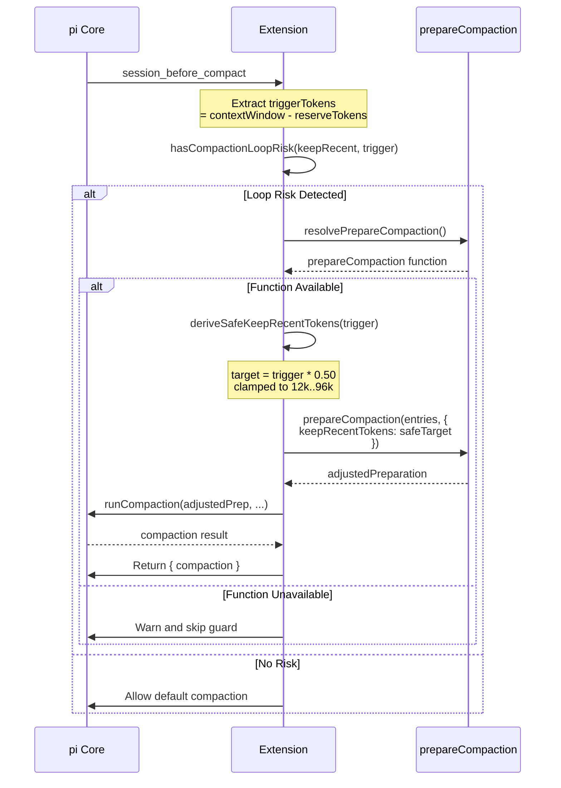

# Compaction Guard: Loop-Risk Interception

Part of [[custom-compaction-architecture|Custom Compaction Architecture]].

The guard prevents **compaction thrashing** - when context keeps triggering compaction because `keepRecentTokens` is too large relative to the trigger threshold.

---

## Flow Diagram

---

## Key Constants

| Constant | Value | Purpose |
|----------|-------|---------|
| `COMPACTION_LOOP_RISK_RATIO` | 0.85 (85%) | Threshold ratio triggering loop risk |
| `COMPACTION_SAFE_KEEP_RATIO` | 0.50 (50%) | Target ratio for safe keepRecentTokens |
| `COMPACTION_SAFE_KEEP_MIN` | 12,000 | Minimum safe keep tokens |
| `COMPACTION_SAFE_KEEP_MAX` | 96,000 | Maximum safe keep tokens |

---

## Sequence Diagram

---

## Implementation Notes

1. **Trigger Calculation**: `triggerTokens = contextWindow - reserveTokens`
2. **Risk Detection**: Loop risk when `keepRecentTokens >= triggerTokens * 0.85`
3. **Safe Target**: `safeTarget = clamp(triggerTokens * 0.50, 12000, 96000)`
4. **Fallback**: If `prepareCompaction` is unavailable from host, guard is skipped with warning
