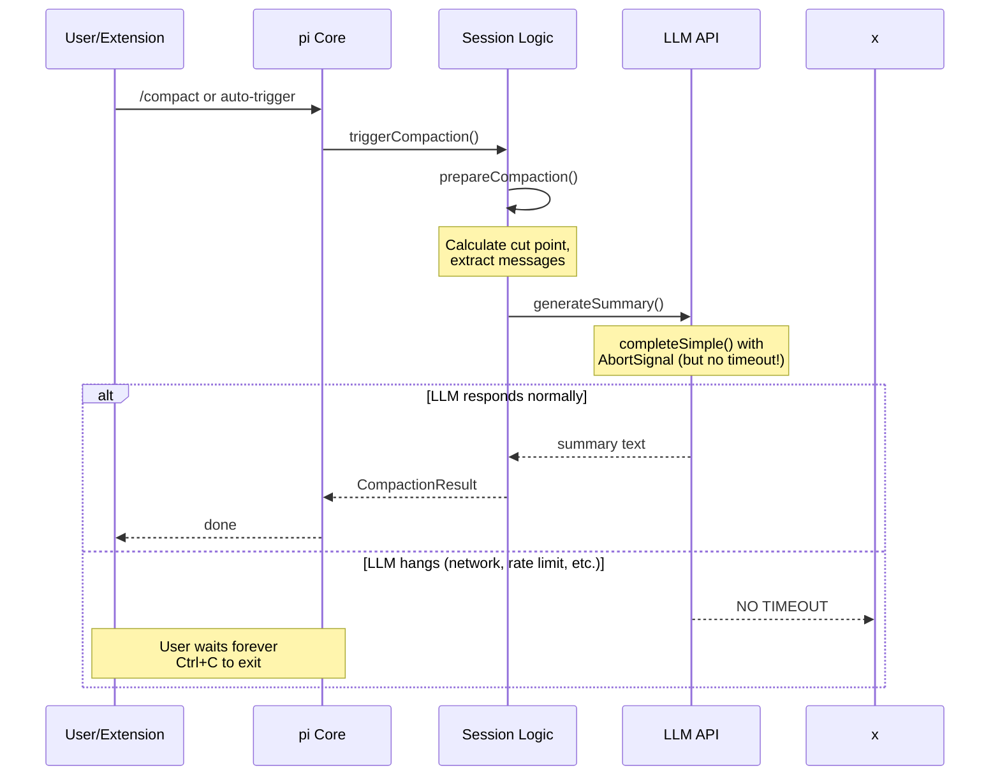

# Compaction Hanging Analysis & API Change Proposals

## Root Cause Analysis

### Why Compaction Hangs

Compaction can hang indefinitely because **there is no timeout mechanism in pi core**.



### Current State: No Timeout Protection

| Path | Trigger | Timeout? | Can Abort? |
|------|---------|----------|------------|
| `/compact` command | Manual | ❌ None | ❌ No API |
| Auto-compaction | Context full | ❌ None | ❌ No API |
| `ctx.compact()` | Extension | ❌ None | ❌ No API |
| `session_before_compact` hook | Pre-compaction | ⚠️ Handler signal only | ❌ Not for LLM call |
| Extension failure-recovery | Tool failures | ✅ 2min (extension) | ⚠️ `ctx.abort()` unclear |

### Key Code Locations (pi-mono repo)

| File | Line | Issue |
|------|------|-------|
| `packages/coding-agent/src/core/compaction/compaction.ts` | `generateSummary()` | Calls `completeSimple` without timeout |
| `packages/coding-agent/src/core/extensions/types.ts` | `CompactOptions` | No `timeout` or `signal` option |
| `packages/coding-agent/src/core/extensions/types.ts` | `ExtensionContext.compact()` | Fire-and-forget, no abort mechanism |
| `packages/coding-agent/src/core/settings-manager.ts` | `CompactionSettings` | No `timeoutMs` setting |

---

## Proposed API Changes

### 1. Add Compaction Timeout Setting

**File:** `packages/coding-agent/src/core/settings-manager.ts`

```typescript
// Current
export interface CompactionSettings {
  enabled: boolean;
  reserveTokens: number;
  keepRecentTokens: number;
}

// Proposed
export interface CompactionSettings {
  enabled: boolean;
  reserveTokens: number;
  keepRecentTokens: number;
  /** Timeout in milliseconds for compaction LLM calls. Default: 120000 (2 minutes) */
  timeoutMs?: number;
}
```

**File:** `packages/coding-agent/src/core/compaction/compaction.ts`

```typescript
// Current
export async function generateSummary(
  currentMessages: AgentMessage[],
  model: Model<any>,
  reserveTokens: number,
  apiKey: string,
  signal?: AbortSignal,
  customInstructions?: string,
  previousSummary?: string
): Promise<string>

// Proposed - add timeoutMs parameter
export async function generateSummary(
  currentMessages: AgentMessage[],
  model: Model<any>,
  reserveTokens: number,
  apiKey: string,
  signal?: AbortSignal,
  customInstructions?: string,
  previousSummary?: string,
  timeoutMs?: number  // NEW
): Promise<string> {
  const maxTokens = Math.floor(0.8 * reserveTokens);
  // ... build prompt ...

  // Create timeout controller
  const timeoutController = new AbortController();
  const timeoutId = setTimeout(
    () => timeoutController.abort(),
    timeoutMs ?? 120000  // Default 2 minutes
  );

  // Merge signals if provided
  const combinedSignal = signal
    ? AbortSignal.any([signal, timeoutController.signal])
    : timeoutController.signal;

  try {
    const response = await completeSimple(
      model,
      { systemPrompt: SUMMARIZATION_SYSTEM_PROMPT, messages: summarizationMessages },
      { maxTokens, signal: combinedSignal, apiKey, reasoning: "high" }
    );
    // ... rest of function ...
  } finally {
    clearTimeout(timeoutId);
  }
}
```

### 2. Add Timeout to CompactOptions

**File:** `packages/coding-agent/src/core/extensions/types.ts`

```typescript
// Current
export interface CompactOptions {
  customInstructions?: string;
  onComplete?: (result: CompactionResult) => void;
  onError?: (error: Error) => void;
}

// Proposed
export interface CompactOptions {
  customInstructions?: string;
  /** Timeout in milliseconds. Overrides settings.compaction.timeoutMs */
  timeoutMs?: number;
  /** AbortSignal for programmatic cancellation */
  signal?: AbortSignal;
  onComplete?: (result: CompactionResult) => void;
  onError?: (error: Error) => void;
  /** Called when compaction times out (before onError) */
  onTimeout?: () => void;
}
```

### 3. Add Compaction Abort API

**File:** `packages/coding-agent/src/core/extensions/types.ts`

```typescript
// Current
export interface ExtensionContext {
  // ...
  compact(options?: CompactOptions): void;
}

// Proposed - return abort handle
export interface ExtensionContext {
  /**
   * Trigger compaction. Returns an abort function.
   * @param options Compaction options
   * @returns Function to abort the compaction, or undefined if already complete
   */
  compact(options?: CompactOptions): (() => void) | undefined;
}
```

### 4. Update session_before_compact Event

**File:** `packages/coding-agent/src/core/extensions/types.ts`

```typescript
// Current
export interface SessionBeforeCompactEvent {
  type: "session_before_compact";
  preparation: CompactionPreparation;
  branchEntries: SessionEntry[];
  customInstructions?: string;
  signal: AbortSignal;
}

// Proposed - add timeout info
export interface SessionBeforeCompactEvent {
  type: "session_before_compact";
  preparation: CompactionPreparation;
  branchEntries: SessionEntry[];
  customInstructions?: string;
  signal: AbortSignal;
  /** Configured timeout in milliseconds (from settings or override) */
  timeoutMs: number;
}
```

---

## Implementation Details

### Timeout Controller Pattern

```typescript
// In compaction orchestration (session manager or agent session)
function runCompactionWithTimeout(
  options: CompactOptions,
  settings: CompactionSettings
): { abort: () => void } {
  const timeoutMs = options.timeoutMs ?? settings.timeoutMs ?? 120000;
  const timeoutController = new AbortController();

  const timeoutId = setTimeout(() => {
    timeoutController.abort(new Error(`Compaction timed out after ${timeoutMs}ms`));
    options.onTimeout?.();
  }, timeoutMs);

  // Merge with user-provided signal
  const signal = options.signal
    ? AbortSignal.any([options.signal, timeoutController.signal])
    : timeoutController.signal;

  doCompaction({
    ...options,
    signal,
    onComplete: (result) => {
      clearTimeout(timeoutId);
      options.onComplete?.(result);
    },
    onError: (error) => {
      clearTimeout(timeoutId);
      options.onError?.(error);
    },
  });

  return {
    abort: () => {
      clearTimeout(timeoutId);
      timeoutController.abort(new Error('Compaction aborted by user'));
    },
  };
}
```

### Settings JSON Example

```json
{
  "compaction": {
    "enabled": true,
    "reserveTokens": 16384,
    "keepRecentTokens": 20000,
    "timeoutMs": 120000
  }
}
```

---

## Summary: Required Changes

| Component | File | Change |
|-----------|------|--------|
| Settings type | `settings-manager.ts` | Add `timeoutMs?: number` to `CompactionSettings` |
| Settings default | `compaction.ts` | Default `timeoutMs: 120000` |
| Summary generation | `compaction.ts` | Pass timeout to `completeSimple` via AbortSignal |
| Extension API | `types.ts` | Add `timeoutMs`, `signal`, `onTimeout` to `CompactOptions` |
| Context API | `types.ts` | Return abort function from `ctx.compact()` |
| Event type | `types.ts` | Add `timeoutMs` to `SessionBeforeCompactEvent` |

---

## Workaround for Extensions (Current API)

Until pi core adds timeout support, extensions can implement their own watchdog:

```typescript
function compactWithWatchdog(
  ctx: ExtensionContext,
  options: CompactOptions & { timeoutMs?: number }
): () => void {
  const timeoutMs = options.timeoutMs ?? 120000;
  let settled = false;

  const timeoutId = setTimeout(() => {
    if (settled) return;
    settled = true;

    // Try to abort via ctx.abort() - may not work for compaction
    if (!ctx.isIdle()) {
      ctx.abort();
    }

    options.onTimeout?.();
    if (ctx.hasUI) {
      ctx.ui.notify(`Compaction timed out after ${timeoutMs / 1000}s`, "warning");
    }
  }, timeoutMs);

  // Unref to not block process exit
  if (typeof timeoutId === 'object' && 'unref' in timeoutId) {
    (timeoutId as NodeJS.Timeout).unref();
  }

  ctx.compact({
    ...options,
    onComplete: (result) => {
      if (settled) return;
      settled = true;
      clearTimeout(timeoutId);
      options.onComplete?.(result);
    },
    onError: (error) => {
      if (settled) return;
      settled = true;
      clearTimeout(timeoutId);
      options.onError?.(error);
    },
  });

  return () => {
    if (settled) return;
    settled = true;
    clearTimeout(timeoutId);
    ctx.abort(); // Best effort
  };
}
```

**Limitation:** `ctx.abort()` may not actually cancel the compaction LLM call - it's designed for aborting agent streaming.

---

## Recommended Priority

1. **High:** Add `timeoutMs` to `CompactionSettings` - affects all users
2. **High:** Implement timeout in `generateSummary()` - core fix
3. **Medium:** Add `signal` to `CompactOptions` - allows programmatic abort
4. **Low:** Return abort function from `ctx.compact()` - nice-to-have UX
