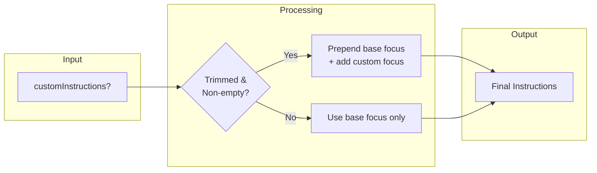
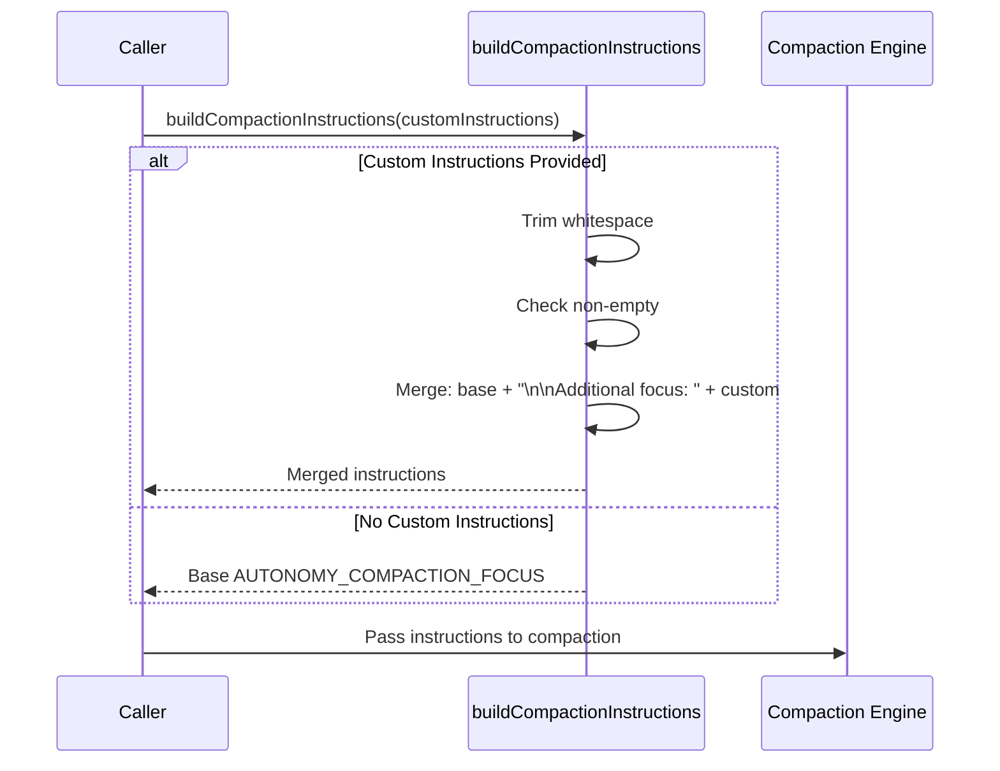
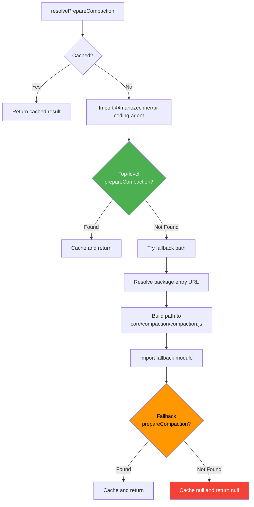
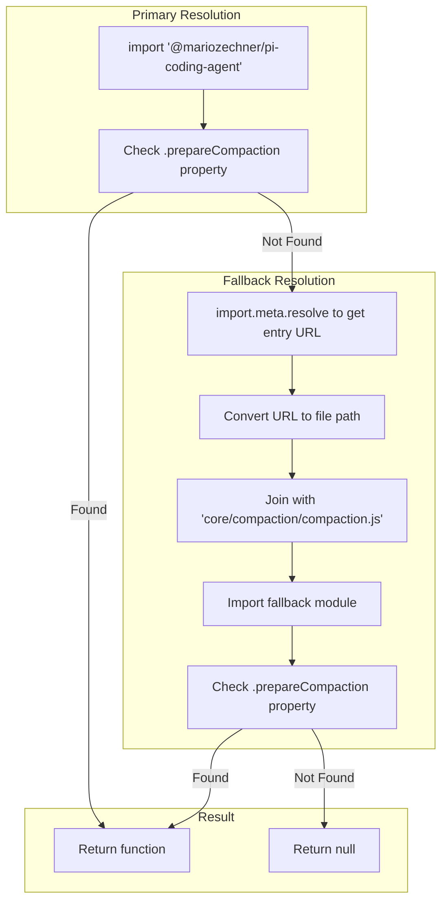

# Compaction Helpers

Part of [[custom-compaction-architecture|Custom Compaction Architecture]].

---

## Custom Instructions Merging

All compaction operations can include custom focus instructions that are merged with the base autonomy focus.



### Base Focus

```typescript
const AUTONOMY_COMPACTION_FOCUS = `
Compress aggressively while preserving engineering continuity.
Prioritize explicit decisions, unresolved risks, invariants,
and exact file paths/functions/errors.
Drop repetitive narration and keep the summary concise
enough to avoid repeat compaction churn.
`;
```

### Building Logic



---

## resolvePrepareCompaction: Host API Discovery

The extension uses dynamic module resolution to find the `prepareCompaction` function from pi's API.



### Resolution Strategy



---

## Implementation Notes

1. **Caching**: Result is cached after first resolution
2. **Fallback Path**: Handles different package export layouts
3. **Graceful Degradation**: Returns null if unavailable, guard skips intervention
