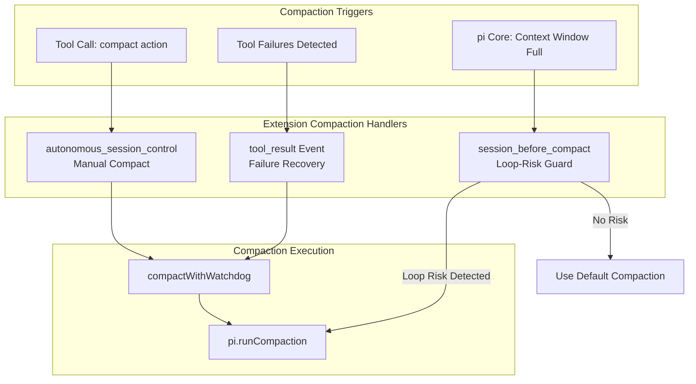
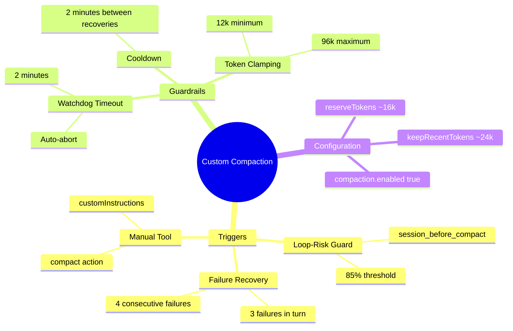

# Custom Compaction Architecture

This document explains how the custom compaction system works in `pi-autonomous-session-control`.

---

## Overview: Why Custom Compaction?

The extension provides **three compaction mechanisms**:

1. **Compaction Guard (Loop-Risk Interception)** - Intercepts risky compactions before they happen
2. **Failure-Burst Recovery Compaction** - Triggered automatically on repeated tool failures
3. **Manual Compaction via Tool** - On-demand compaction with custom instructions

---

## Detailed Documentation

For implementation details, see:

- [[compaction-guard|Compaction Guard]] - Loop-risk interception logic
- [[failure-recovery-compaction|Failure Recovery]] - Automatic recovery on tool failures
- [[compaction-helpers|Compaction Helpers]] - Instructions merging and API discovery
- [[compaction-configuration|Configuration]] - Required settings and thresholds

---

## Summary: Key Components

| Component | File | Purpose |
|-----------|------|---------|
| Loop-Risk Guard | `autonomy-control.ts` | Intercepts risky compactions in `session_before_compact` |
| Failure Recovery | `autonomy-control.ts` | Auto-triggers compaction on tool failure bursts |
| Watchdog | `compact-with-watchdog.ts` | 2-minute timeout for compaction operations |
| Resolver | `resolve-prepare-compaction.ts` | Discovers `prepareCompaction` from pi API |
| Helpers | `helpers.ts` | Token calculations and instruction building |
| Constants | `constants.ts` | Thresholds, ratios, and timeout values |

