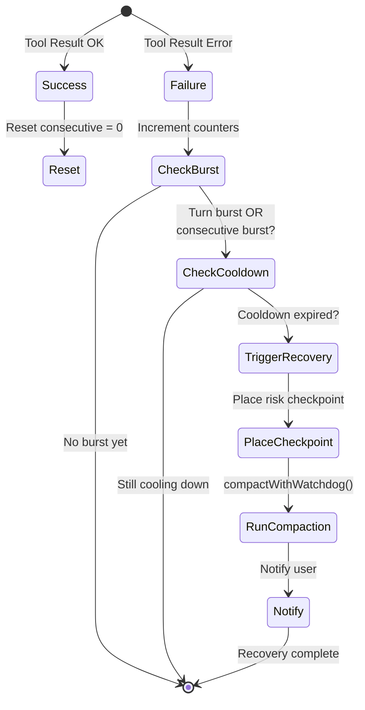
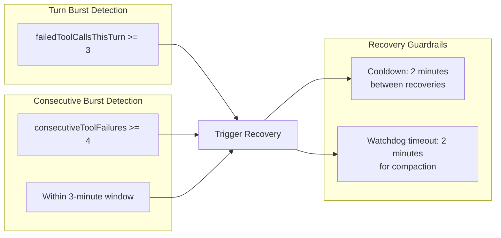
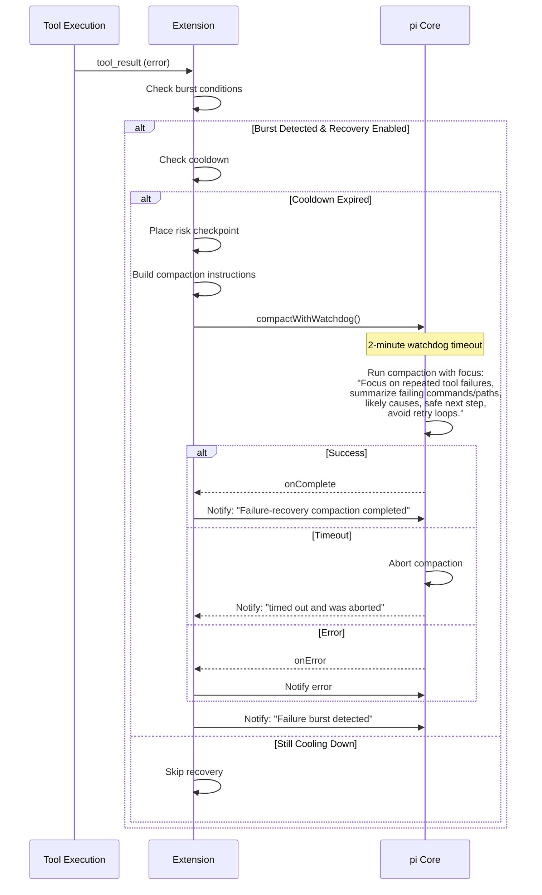
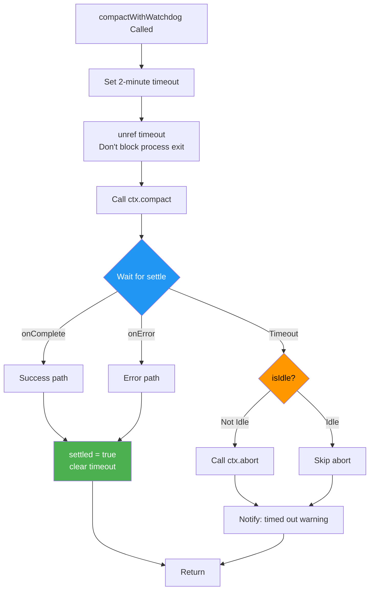

# Failure Recovery Compaction

Part of [[custom-compaction-architecture|Custom Compaction Architecture]].

When tools fail repeatedly, the extension automatically triggers a **recovery compaction** with focused instructions.

---

## Failure Detection State Machine



---

## Detection Thresholds

| Threshold | Value | Purpose |
|-----------|-------|---------|
| `FAILURE_BURST_IN_TURN_THRESHOLD` | 3 | Failures in single turn to trigger |
| `FAILURE_CONSECUTIVE_THRESHOLD` | 4 | Consecutive failures to trigger |
| `FAILURE_BURST_WINDOW_MS` | 180,000 (3 min) | Window for consecutive count |
| `FAILURE_RECOVERY_COOLDOWN_MS` | 120,000 (2 min) | Cooldown between recoveries |



---

## Recovery Sequence



---

## Watchdog Timeout Mechanism

The `compactWithWatchdog` function ensures compaction operations don't hang indefinitely.



---

## Recovery Instructions

Recovery compaction uses focused instructions:

```
Focus on repeated tool failures: summarize failing commands/paths,
likely causes, safe next step, and avoid retry loops.
```

This is combined with the base [[compaction-helpers|AUTONOMY_COMPACTION_FOCUS]].
