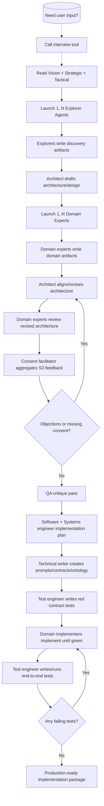
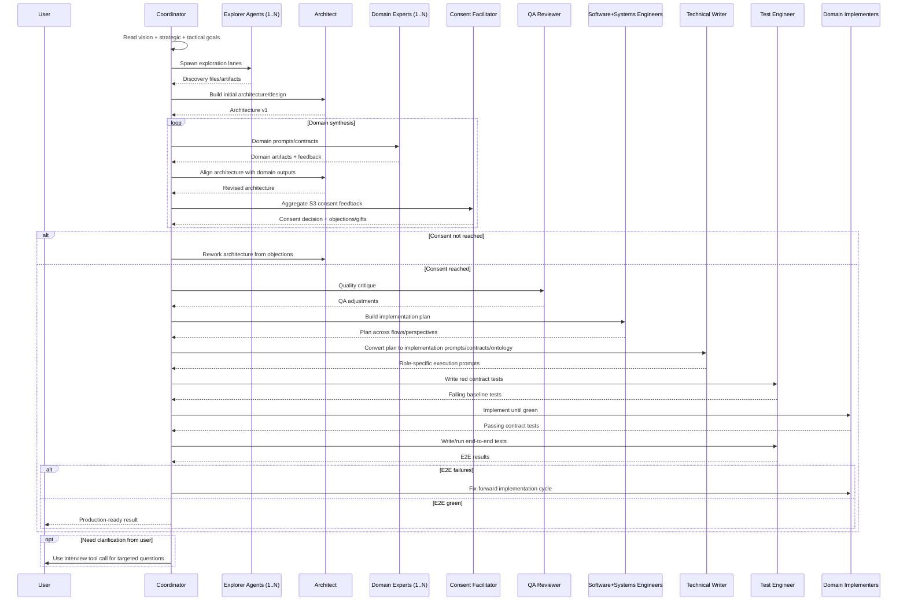

# User source text (verbatim)

```text
how about utilizing http://github.com/nicobailon/pi-interview-tool for the back and forth, if needed? so this is only a toolcall and you get the information back. no message needed from me. so my thinking is you get the vision, the strategic goal, and the tactical one, then you task one or multiple explorer agents (that are equipped with ast-grep codemapper and other tools), these write files. than you prompt an architect that generates an architectural / design structure and prompt multiple domain experts (by calling them with their own systemprompts based on their task, these write also files, then the architect reviews them and tries to align the original vision with the files from the domain experts. the revised vision then gets send back to the domain experts. they will compare the revised vision with their own file they have written. then each and every domain expert provides feedback (in form of consent (sociocracy 3.0). they report back. you form a prompt for the consent facilitator (s3) to combine the feedback from the domain experts on the revised architecture. if there are no gifts, you call the architect again with the provided feedback from the domain experts to create a compehensive production ready document. you critique as you assume the role of an quality assurance fellow and then you distribute it to a software engineer fellow level that does write an implementation plan including all the flows from every perspective that needs to be written. probably an additional systems engineer needs to support here, then a technical writer verifies that and writes prompts to the implementation roles (multiples, for each domain one) as each get a clear contract with boundaries and ontology. First the test engineer writes red tests for each domain / contract for all the flows the engineer came up with. then the domain implementers can implmement until everything is green. Then the test engineer writes end2end tests for the task at hand if anything fails you take over and fix it. if you ever need feedback from me you use a bash tool to invoke http://github.com/nicobailon/pi-interview-tool

intent counts not my exact words, as english is my second language
```

# Interpretation (concise)

1. **Input triad first**: vision + strategic goals + tactical goals.
2. **Exploration stage**: one or many explorer lanes produce concrete artifacts/files.
3. **Architecture stage**: architect synthesizes draft design from exploration outputs.
4. **Domain stage**: multiple domain experts produce domain-specific artifacts.
5. **Alignment loop**: architect revises against domain outputs; domains re-review.
6. **Consent gate (S3)**: consent facilitator aggregates domain feedback.
7. **If objections remain**: feed objections back to architect and repeat alignment/consent loop.
8. **If no objections**: advance to QA critique and implementation planning.
9. **Execution planning chain**: software+systems engineering plan -> technical writer prompt/contracts.
10. **Delivery gate**: tests first (red) -> implementation to green -> end-to-end tests -> fix-forward loop on failures.
11. **Human feedback channel**: invoke interview tool only when additional user clarification is needed.

---

## Mermaid variation 1 — Phase-oriented flowchart



## Mermaid variation 2 — State machine with consent loop

```mermaid
stateDiagram-v2
    [*] --> ReadGoals

    ReadGoals: Load vision/strategic/tactical goals
    ReadGoals --> Explore

    state Explore {
        [*] --> SpawnExplorers
        SpawnExplorers --> ExplorerArtifacts
        ExplorerArtifacts --> [*]
    }

    Explore --> ArchitectDraft
    ArchitectDraft: Architect creates initial architecture/design
    ArchitectDraft --> DomainDrafts

    state DomainDrafts {
        [*] --> SpawnDomains
        SpawnDomains --> DomainArtifacts
        DomainArtifacts --> [*]
    }

    DomainDrafts --> ArchitectRevision
    ArchitectRevision --> DomainReview
    DomainReview --> ConsentFacilitation

    ConsentFacilitation --> ConsentDecision
    ConsentDecision: S3 consent aggregation

    ConsentDecision --> ArchitectRevision: objections remain
    ConsentDecision --> QAReview: consent achieved

    QAReview --> ImplementationPlanning
    ImplementationPlanning --> PromptContractPackaging
    PromptContractPackaging --> RedTests
    RedTests --> DomainImplementation
    DomainImplementation --> E2ETests

    E2ETests --> DomainImplementation: failures found
    E2ETests --> Done: all green

    Done --> [*]
```



## Mermaid variation 3 — Sequence/orchestration view


