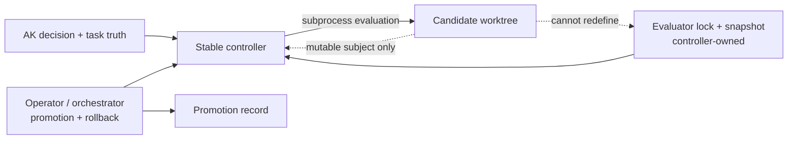

# RFC — supervised self-hosting for `pi-autoresearch`

## Status

Proposed package-local boundary RFC for a possible **post-target widening** after the current bounded control-plane and post-target manifest/campaign slices.

This RFC follows:

- [current-vs-target](./current-vs-target.md)
- [resume/control-surface contract](./resume-control-surface-contract.md)
- [finalization orchestration contract](./finalization-orchestration-contract.md)
- [root architecture correction](../../../../docs/project/pi-autoresearch-architecture-correction.md)
- [live supervision / AK lifecycle status](../../../../docs/project/pi-autoresearch-live-supervision-ak-lifecycle-status.md)
- [self-hosting problem-intent](./2026-04-22-pi-autoresearch-self-hosting-problem-intent.md)

It is intentionally a **boundary RFC**, not an implementation-claim artifact.
Nothing in this note means self-hosting is already landed.

## A) Decision in one sentence

`pi-autoresearch` should adopt self-hosting only as a **supervised controller-versus-candidate campaign model** in which a stable controller version evaluates a candidate version of `packages/pi-autoresearch` under exact AK scope, snapshot-owned evaluator entrypoints, explicit multi-suite applicability gates, and an external promotion/rollback record; it should explicitly reject in-place self-sovereign recursive autonomy.

## B) What this RFC is deciding

This RFC decides:

1. the canonical architecture for self-hosting campaigns
2. the exact artifact set that makes self-hosting explicit instead of chat-memory-driven
3. the runtime/code-loading model that keeps the stable controller from becoming the mutable candidate
4. the evaluator-freeze model that keeps the candidate from rewriting its own judge directly **or transitively** in the same campaign
5. the applicability and evidence thresholds that separate `reject`, `variant_candidate`, and `default_promotion_candidate`
6. the promotion/rollback authority split and the exact record that captures controller rotation
7. which existing bounded surfaces can be reused unchanged, which need adaptation, and which are genuinely new
8. the AK decision legality path required before ADR is legal for this concern
9. the staged rollout from shadow mode to limited supervised self-hosting
10. the first 3-5 implementation slices worth pursuing if this widening is accepted

This RFC does **not** decide:

- that self-hosting must be implemented immediately
- direct automatic merge/promotion of a candidate into package truth
- whole-monorepo or cross-package self-improvement as a first slice
- direct AK mutation from a self-hosting campaign
- broad daemonized autonomy beyond the current bounded supervision model
- new ontology ids for self-hosting-specific semantics
- new Prompt Vault procedures unless later slices prove they are needed

## C) Evidence-backed problem framing

The package now already has real loop mechanics:

- bounded runtime execution
- operator control state
- bounded finalization workflow
- orchestrator-side live supervision

That makes self-hosting plausible.
But it does **not** make self-hosting safe.

The current evidence supports three strong claims:

1. **self-hosting is now possible to discuss seriously**
   - because the package already has execution, control, finalization, and supervision primitives
2. **self-hosting is not safe as a naive extension of ordinary campaigns**
   - because current bounded surfaces do not yet separate controller, candidate, evaluator, and promotion truth
3. **the dominant risk is not missing runtime power but authority collapse**
   - because the existing architecture correction already rejected monolithic self-owning runtime/prompt/task designs

The current evidence does **not** yet prove that self-hosting is automatically the next highest-value package slice.
So this RFC is not a prioritization claim.
It is a legality/boundary claim:

> if self-hosting is pursued, it must be pursued under the stricter contract defined here rather than as an informal extension of ordinary autoresearch campaigns.

## D) Many-of-the-greats confrontation

The deepest live disagreement inside this problem is not whether self-hosting is interesting.
It is what must remain immutable when the system turns its optimizer onto itself.

### School 1 — Hermetic evaluation maximalism

Core claim:
- a self-hosting system is not serious unless the evaluator is completely outside the candidate's mutation surface

What it sees that others miss:
- most self-improvement systems do not fail by obvious cheating
- they fail by **transitive evaluator drift**: candidate-owned scripts, package-manager indirection, runtime selection glue, or wrapper commands silently redefine what success means

What survives from this school:
- the evaluator entrypoint itself must be snapshot-owned
- candidate-owned `package.json` scripts, shell wrappers, or repo-local command dispatch must not define the judge

### School 2 — Brownfield controller pragmatism

Core claim:
- the first slice should reuse the already-landed package and orchestrator surfaces rather than waiting for a brand-new external evaluation platform

What it sees that others miss:
- overcorrecting to full hermetic infrastructure first would delay a bounded truthful experiment even though the repo already has runtime, finalization, and supervision primitives worth reusing

What survives from this school:
- use a stable controller plus candidate worktree model
- keep evaluation as subprocess execution against the candidate where possible
- do not require a new platform before the first bounded slice can exist

### School 3 — Governance legality discipline

Core claim:
- this concern changes authority boundary, lifecycle legality, default workflow behavior, and architecture-significant packet shape, so it must be treated as an AK decision concern rather than an ordinary repo-local implementation note

What it sees that others miss:
- an RFC can be substantively good and still not be legally ready for ADR or rollout if the decision chain is missing or implied

What survives from this school:
- this concern should open as an `ak decision`
- ADR legality must come from the AK decision/passport closure path, not from file chronology alone
- promotion and rollback must be explicit records, not narrative implications

## E) Chosen synthesis

The chosen architecture is a **true synthesis**:

- from hermetic evaluation maximalism:
  - snapshot-owned evaluator entrypoints
  - explicit hash-checked evaluator lock
  - no candidate-owned dispatch may redefine the judge
- from brownfield controller pragmatism:
  - controller-subprocess-against-candidate execution
  - separate candidate worktree/branch
  - reuse of bounded finalization and supervision surfaces where truthful
- from governance legality discipline:
  - AK decision front-door for the concern
  - repo-tracked problem/evidence/review artifacts
  - external promotion/rollback authority

Interpretation rule:

> The first self-hosting slice is not “the package improves itself.”
> It is “a stable controller version evaluates and possibly recommends a candidate successor under a frozen snapshot-owned judge and an external promotion gate.”

## F) Chosen architecture in one view

The chosen self-hosting model has four distinct roles:

- **controller**
  - stable installed runtime or pinned controller ref
  - owns orchestration of the self-hosting campaign
- **candidate**
  - separate branch/worktree under exact AK scope
  - is the only mutable subject under improvement
- **judge**
  - controller-owned evaluator lock + snapshot bundle
  - frozen for the life of the campaign
- **promotion/rollback authority**
  - operator/orchestrator layer above the package
  - records controller rotation explicitly and can revert it explicitly

### Small diagram



## G) Core artifacts and contracts

### 1. Self-hosting campaign contract

The self-hosting campaign must be declared explicitly in one checked controller-owned artifact:

- `autoresearch.self-hosting.json`

This file is resolved from the **controller worktree/cwd**, not from the candidate worktree.
A candidate may contain a same-named file, but the controller must ignore it.

A truthful first shape is:

```ts
interface AutoresearchSelfHostingContractV1 {
  type: "self_hosting_contract";
  version: 1;
  campaignId: string;
  controller: {
    mode: "stable_installed" | "pinned_commit";
    ref: string;
    controllerCwd: string;
    executionModel: "controller_subprocess_against_candidate";
  };
  candidate: {
    worktreePath: string;
    baseRef: string;
    branchName: string;
    allowedPaths: string[];
    offLimits: string[];
    onFailureDisposition: "preserve_for_review" | "cleanup_after_receipt";
  };
  evaluator: {
    lockPath: string;
    manifestPath: string;
    manifestHash: string;
    snapshotRootPath: string;
    criticalSuites: string[];
    devSuites: string[];
    holdoutSuites: string[];
    transferSuites: string[];
    candidateMayEditEvaluator: false;
  };
  applicability: {
    primaryMetric: {
      name: string;
      direction: "lower" | "higher";
      minImprovementForDefaultPromotionPercent: number;
    };
    variantTargetProfile: {
      id: string;
      description: string;
    } | null;
    maxCriticalSuiteFailures: 0;
    maxHoldoutCriticalFailures: 0;
    maxTransferCriticalFailures: 0;
    maxNonCriticalTransferRegressionPercent: number;
    minimumDefaultPromotionTransferScope: {
      minimumSuites: 2;
      requiredCoverageKinds: Array<
        "package_non_self_hosting"
        | "operator_consumer"
      >;
    };
  };
  promotion: {
    packageMaySelfPromote: false;
    requiredApprovals: Array<
      "operator_review"
      | "orchestrator_supervision"
    >;
    promotionRecordPath: string;
    rollbackControllerRef: string;
  };
}
```

### 2. Evaluator lock / snapshot artifact

The judge must be frozen in a second controller-owned artifact:

- `autoresearch.self-hosting.evaluator.lock.json`

A truthful first shape is:

```ts
interface AutoresearchSelfHostingEvaluatorLockV1 {
  type: "self_hosting_evaluator_lock";
  version: 1;
  campaignId: string;
  snapshotRootPath: string;
  manifestPath: string;
  manifestHash: string;
  executionModel: "controller_subprocess_against_candidate";
  evaluatorFiles: Array<{
    path: string;
    sha256: string;
  }>;
  suites: Array<{
    id: string;
    class: "dev" | "holdout" | "transfer";
    critical: boolean;
    coverageKind:
      | "self_hosting_internal"
      | "package_non_self_hosting"
      | "operator_consumer";
    entrypoint: {
      kind: "snapshot_script" | "snapshot_node_module";
      path: string;
      sha256: string;
    };
    subjectCwdMode: "snapshot" | "candidate";
    argv: string[];
  }>;
}
```

Interpretation rule:

- the evaluator lock lives in the controller-owned side of the campaign
- it is resolved and hashed before candidate mutation begins
- the controller must fail closed if any locked evaluator file hash changes during the campaign
- the candidate may change files in its own worktree, but those changes do not redefine the judge because evaluator **entrypoints** are always resolved from the controller-owned snapshot, never from candidate-owned dispatch
- `subjectCwdMode = "candidate"` means only that the candidate is the subject under test; it does **not** authorize candidate-owned command resolution

### 3. Promotion / rollback record

Controller rotation must be recorded explicitly in a third artifact:

- `autoresearch.self-hosting.promotion.json`

A truthful first shape is:

```ts
interface AutoresearchSelfHostingPromotionRecordV1 {
  type: "self_hosting_promotion_record";
  version: 1;
  campaignId: string;
  approvedBy: string[];
  approvedAt: number | null;
  previousControllerRef: string;
  promotedCandidateRef: string | null;
  evaluatorManifestHash: string;
  evidenceRefs: string[];
  status: "planned" | "approved" | "rotated" | "rolled_back" | "superseded";
  rollbackControllerRef: string;
  rollbackReason: string | null;
  rolledBackAt: number | null;
}
```

Interpretation rule:

- this local record is a projection of the promotion/rollback decision, not the sole durable truth
- AK still owns the durable campaign/task truth above it
- the package runtime itself never writes a record that implies self-promotion without external approval

## H) Execution isolation contract

The stable controller must not accidentally become the mutable candidate during a campaign.

### Chosen runtime/code-loading model

The first self-hosting slice uses exactly this model:

1. the controller runs from the currently trusted installed runtime or an explicitly pinned controller ref
2. the candidate lives in a **separate git worktree/branch** under exact AK scope
3. the controller evaluates the candidate only by **subprocess commands against the candidate worktree**
4. the controller process does **not** import candidate extension/runtime modules into its own live process during Stages 0-2
5. candidate controller rotation, if later approved, is a separate explicit install/reload step above the package and after promotion approval

### Why this model is chosen

This is the smallest truthful answer to the reviewer question about runtime bleed-through:

- it avoids in-process mutation of the active controller
- it keeps brownfield package reuse high
- it is strict enough to test

### Explicitly forbidden in the first slice

- dynamic in-process loading of candidate extension code into the active controller session
- treating candidate source edits as active controller behavior before promotion
- evaluating controller rotation by simply continuing in the mutated process

## I) Evaluator freeze contract

The evaluator must be meaningfully outside the mutable candidate even when both live in the same repo/package family.

### Chosen freeze model

The controller freezes the judge by materializing and hashing a controller-owned evaluator bundle before candidate mutation begins.

That means:

1. evaluator manifest/commands are copied or resolved into `snapshotRootPath` owned by the controller side of the campaign
2. `autoresearch.self-hosting.evaluator.lock.json` records exact file hashes, suite classes, coverage kinds, and snapshot-owned entrypoints
3. every evaluation re-checks those hashes before running
4. any mismatch fails the campaign closed as evaluator drift
5. candidate worktree files with the same paths/names do not redefine the evaluator because the controller never reads evaluator entrypoints from the candidate worktree
6. candidate-owned scripts/config may affect the **subject under test**, but must not affect evaluator entrypoint selection, suite composition, threshold resolution, or classification rules

### Safe vs unsafe evaluator commands

#### Safe

- `node <snapshotRootPath>/suites/run-dev-suite.mjs --candidate /abs/path/to/candidate`
- `<snapshotRootPath>/bin/run-transfer-suite --candidate /abs/path/to/candidate --mode operator-consumer`
- snapshot-owned script executed with `subjectCwdMode = candidate` when the script path itself resolves from the evaluator lock

#### Unsafe

- `npm run check` executed from the candidate worktree
- `pnpm test` executed from the candidate worktree
- `node ./scripts/eval.mjs` when `./scripts/eval.mjs` resolves inside the candidate worktree
- any evaluation path that lets candidate-owned `package.json`, shell aliases, workspace config, or wrapper scripts select the real judge

Interpretation rule:

> the candidate may be the subject of evaluation,
> but the candidate must not be the source of evaluator entrypoint truth.

### Example — candidate mutates `package.json`

Suppose the candidate changes:

- `packages/pi-autoresearch/package.json#scripts.check`

That mutation **does** affect candidate repo state.
It may even be the point of the candidate.
But it does **not** change the frozen judge in the same campaign if the evaluator lock still says the suite entrypoint is:

- `node <snapshotRootPath>/suites/run-checks.mjs --candidate <worktree>`

In that case the judge remains snapshot-owned.
The candidate's `package.json` script cannot redefine the evaluator because the evaluator never calls `npm run check` from the candidate worktree.

### Why this is enough for the first slice

This is not a full external platform.
But it does answer the reviewer-grade concern:

- controller and candidate may belong to the same repo family
- the judge is still frozen outside the mutable candidate path
- candidate edits cannot silently move the goalposts inside the same campaign

## J) Applicability and evidence thresholds

The self-hosting result model is only useful if `reject`, `variant_candidate`, and `default_promotion_candidate` are governed by explicit evidence thresholds.

### 1. `reject`

A result is `reject` when any of the following is true:

- any critical suite fails
- evaluator lock/hash verification fails
- candidate touches off-limits paths
- any holdout critical suite fails
- any transfer critical suite fails
- primary metric does not improve enough to justify retention for even a declared target profile
- the campaign cannot produce a truthful promotion/rollback target
- the required minimum transfer-suite coverage for default promotion cannot be established

### 2. `variant_candidate`

A result is `variant_candidate` when all of the following are true:

- all critical dev suites pass
- all critical holdout suites pass
- all critical transfer suites pass
- `applicability.variantTargetProfile` was declared before the campaign started
- the candidate improves that declared target profile or primary metric in a real way
- the candidate does **not** satisfy the general/default thresholds for promotion
- the specialized benefit can be named truthfully without claiming broad package improvement

Typical causes:

- improvement is concentrated in one declared workflow/profile
- transfer behavior is neutral or slightly worse but still within the declared non-critical budget
- the candidate is useful as an opt-in mode, not as a new default

### 3. `default_promotion_candidate`

A result is `default_promotion_candidate` only when all of the following are true:

- all critical dev suites pass
- all critical holdout suites pass
- all critical transfer suites pass
- primary metric improvement meets or exceeds `minImprovementForDefaultPromotionPercent`
- non-critical transfer regression stays within `maxNonCriticalTransferRegressionPercent`
- the evaluator lock still matches
- no off-limits path mutation occurred
- the evaluator includes at least the minimum transfer-suite coverage declared in `minimumDefaultPromotionTransferScope`
- rollback target and promotion record are fully populated

Interpretation rule:

> A candidate does not become a default-promotion candidate by being merely “better on the main benchmark.”
> It must be better **without collapsing the general package envelope**.

### Minimum transfer-suite scope for default promotion

Default promotion is not legal unless the evaluator manifest includes at least:

1. one transfer suite with `coverageKind = package_non_self_hosting`
2. one transfer suite with `coverageKind = operator_consumer`

If the campaign cannot supply both, then `default_promotion_candidate` is blocked.
At best the result may still qualify as `variant_candidate`.

## K) Authority split

| Concern | Owner | Why |
|---|---|---|
| Controller execution, candidate-local bounded experimentation, receipt/event capture, self-hosting contract validation, applicability classification | `packages/pi-autoresearch` | This remains package-local runtime/orchestration behavior |
| Durable campaign/task identity, exact allowed scope, required artifacts, and durable success record | AK | Self-hosting does not remove repo-native campaign truth |
| Frozen evaluator definition for one campaign | controller-owned lock/snapshot artifact + external review | The judge must be explicit and stable for the campaign, not mutable candidate state |
| Durable decision procedures if later self-hosting-specific prompts are needed | Prompt Vault | Keep durable decision text out of local ad-hoc prompt glue |
| Live supervision, external promotion gating, and any later bounded lifecycle automation | orchestrator/operator above the package | Promotion and controller rotation remain above the candidate loop |
| Candidate review-branch materialization | existing bounded finalization workflow | Reuse landed bounded surfaces rather than inventing a second git control plane |

Interpretation rule:

> `pi-autoresearch` may run the bounded self-hosting campaign.
> It still does not become the sole owner of scope truth, evaluation truth, or promotion truth.

## L) Stable core vs adapted boundary

The existing package/orchestrator surfaces do not all change equally.

| Surface | Reuse status | Why |
|---|---|---|
| package-local XState runtime ownership | **unchanged** | Self-hosting still keeps executable domain state in the package |
| AK as durable campaign truth | **unchanged** | Self-hosting does not move durable task truth into local artifacts |
| bounded finalization safety posture | **unchanged in principle** | plan-first, approval-before-mutation, and narrow mutation remain the same |
| `autoresearch_runtime_run` | **adapted** | controller now evaluates a candidate worktree under a frozen evaluator contract |
| `autoresearch_runtime_control` | **adapted** | needs self-hosting-specific intent/status wording around controller/candidate/applicability |
| `autoresearch_runtime_finalize` | **adapted** | materializes candidate-review branches rather than ordinary kept-run groupings alone |
| `autoresearch_live_supervision` | **adapted** | must supervise controller/candidate self-hosting campaigns rather than only ordinary package campaigns |
| evaluator lock / promotion record handling | **new** | ordinary campaigns do not need frozen judge + controller-rotation records |

This separation is important:

- the stable architecture does **not** need reinvention
- but self-hosting is **not** a zero-adapter feature either

## M) AK decision legality path

This concern should open as an **`ak decision` concern** before ADR progression.

Reason:

Per the canonical AK decision runtime rules, `ak decision` is the truthful front door when the concern changes any of these:

- authority boundary
- canonical source of truth
- lifecycle legality
- default workflow behavior
- architecture-significant packet/contract shape

This self-hosting concern changes all five.

### Required legality chain for this concern

Before ADR is legal, the concern should have:

1. one AK decision record whose `rfc_ref` is this RFC
2. one repo-tracked `problem_brief`
3. one repo-tracked `evidence_note`
4. one repo-tracked `review_memo` whose outcome is the controlling closure
5. one AK passport whose `legal_review_closure` resolves truthfully to the latest controlling review artifact

### Review closure mode

For the first slice, the truthful default is:

- `review_closure_mode = bootstrap_single_track`

unless a later explicit multi-lane review set is activated and synthesized through AK's controlling closure path.

### Important legality rule

ADR legality comes from the latest controlling AK review closure for this concern.
It does **not** come from file chronology alone.

## N) Transitional compatibility and migration mechanics

The first self-hosting slice must coexist cleanly with the already-landed ordinary campaign model.

### Compatibility rules

1. self-hosting is a **new campaign type**, not a reinterpretation of all existing autoresearch history
2. ordinary `autoresearch_runtime_*` flows remain valid for non-self-hosting campaigns
3. existing `autoresearch.jsonl`, `autoresearch.events.jsonl`, `autoresearch.runtime.json`, and `autoresearch.finalization.json` keep their current meanings for ordinary campaigns
4. enabling self-hosting must not silently rewrite existing campaign artifacts into new semantics

### Migration mechanics for the first slice

A truthful first migration path is:

1. create an exact AK decision + task context for the self-hosting concern/campaign
2. create the candidate worktree/branch
3. materialize the controller-owned self-hosting contract + evaluator lock
4. run the bounded campaign against the candidate worktree
5. classify the result as reject / variant candidate / default-promotion candidate
6. only then, if appropriate, prepare review branches and external promotion review

### Failure cleanup / retention policy

If the first self-hosting campaign fails before promotion:

- the controller remains unchanged
- ordinary package runtime truth remains unchanged
- candidate worktree retention vs cleanup follows `candidate.onFailureDisposition`
- evidence/receipts remain inspectable regardless of cleanup policy

Interpretation rule:

- cleanup policy is campaign truth declared up front
- it is not an ambient operator guess made after failure

## O) Prompt Vault posture

The first self-hosting slice does **not** require new Prompt Vault procedures.

Reason:

- the main missing gap is not prompt text generation
- it is controller/candidate isolation, evaluator freeze, applicability gating, legality path, and promotion/rollback truth

So the first slice should assume:

- no new self-hosting-specific Prompt Vault templates are required
- existing package/runtime decision surfaces remain sufficient unless later evidence proves otherwise

A later follow-on may revisit Prompt Vault only if self-hosting creates a real reusable need for:

- candidate applicability adjudication guidance
- promotion/rollback review packet generation
- or another durable decision procedure that is genuinely cross-campaign and not better expressed as code + typed contract

## P) Promotion and rollback contract

### Who performs controller rotation?

Controller rotation is performed by an **external operator gate above the package**, optionally supported by orchestrator supervision evidence.

It is **not** performed by the package runtime itself.

### What records the decision?

The exact local projection is:

- `autoresearch.self-hosting.promotion.json`

The durable campaign truth still belongs in AK/evidence above that file.

### When is rotation legal?

Only when all of the following are true:

1. the result is classified `default_promotion_candidate`
2. the evaluator lock still matches
3. required approvals in the self-hosting contract are satisfied
4. the promotion record names the `previousControllerRef` and `rollbackControllerRef`
5. the operator performs an explicit controller-rotation action above the package

### What is rollback?

Rollback means:

1. restore `rollbackControllerRef` as the active controller
2. record the rollback in `autoresearch.self-hosting.promotion.json`
3. record/update the corresponding AK evidence/task truth
4. rerun the post-promotion verification suites truthfully against the restored controller

### What triggers rollback?

The first slice should treat rollback as required when any of the following is true after promotion:

- post-promotion verification suites fail
- real operator use reveals a regression serious enough to violate the promotion contract
- evaluator/promotion evidence is later found to be incomplete or misleading

Interpretation rule:

> promotion is an explicit reversible act above the package,
> not a side effect of the package deciding it likes its own candidate.

## Q) Worked examples

### Example 1 — `reject`

Scenario:

- candidate improves one local benchmark for manifest-campaign planning
- but a critical holdout suite covering finalization freshness fails

Outcome:

- `reject`

Why:

- a critical holdout failure means the candidate is not even safe as a specialized win under this contract

### Example 2 — `variant_candidate`

Scenario:

- campaign declares `variantTargetProfile = fast_local_self_hosting_analysis`
- candidate improves that declared profile
- all critical suites pass
- transfer suites for ordinary repo-local campaigns are slightly worse but still within the declared non-critical budget
- the gain is real but not broad enough to justify replacing the default package behavior

Outcome:

- `variant_candidate`

Why:

- the change is useful, but only truthfully as an opt-in mode/profile

### Example 3 — `default_promotion_candidate`

Scenario:

- candidate improves the declared primary metric beyond the default-promotion threshold
- all critical dev/holdout/transfer suites pass
- transfer coverage includes both `package_non_self_hosting` and `operator_consumer`
- non-critical transfer regression stays within budget
- evaluator lock is unchanged
- promotion record and rollback target are complete

Outcome:

- `default_promotion_candidate`

Why:

- this is the minimum evidence that the candidate improved the package broadly enough to justify external promotion review

## R) Executable validation contract

This RFC is only truthful if the first slice can be validated with executable checks rather than static confidence.

Minimum required proof classes:

1. **controller/candidate isolation proof**
   - tests prove candidate runtime code is not imported into the live controller process during Stages 0-2
2. **evaluator immutability proof**
   - tests prove evaluator hash drift fails closed
   - tests prove same-named evaluator files inside the candidate worktree do not redefine the judge
   - tests prove candidate-owned package-manager scripts cannot redefine snapshot-owned evaluator entrypoints
3. **scope-fence proof**
   - tests prove off-limits path mutation is rejected
4. **applicability classification proof**
   - tests prove reject / variant candidate / default-promotion candidate gating from typed suite outcomes and thresholds
   - tests prove `variant_candidate` requires a declared `variantTargetProfile`
   - tests prove `default_promotion_candidate` is blocked when minimum transfer-suite coverage is missing
5. **promotion/rollback record proof**
   - tests prove controller rotation cannot be reported without approvals and rollback target
   - tests prove rollback updates the promotion record truthfully
6. **docs/contract proof**
   - docs metadata/strict validation remains green after contract changes

Interpretation rule:

> A self-hosting RFC is not validated by a clever narrative.
> It is validated by executable proofs that the controller cannot quietly become judge, candidate, and promoter all at once.

## S) First-slice done-state

The first self-hosting slice is done when all of the following are true:

1. one checked self-hosting contract artifact exists and validates
2. one checked evaluator lock artifact exists and validates
3. one exact self-hosting campaign can target a candidate worktree/branch for `packages/pi-autoresearch`
4. exact path fences prevent widening outside the declared package scope
5. the controller can run bounded experiments against the candidate without importing candidate runtime code into the controller process
6. the candidate cannot modify evaluator/promotion artifacts in the same campaign, directly or transitively through dispatch indirection
7. the evaluation contract includes explicit dev / holdout / transfer suites and typed applicability thresholds
8. the campaign emits one explicit applicability outcome:
   - reject
   - variant candidate
   - default-promotion candidate
9. candidate success leads only to review/promotion readiness, not automatic default promotion
10. promotion and rollback truth are recorded explicitly
11. proof artifacts and docs say clearly what remains out of scope

## T) Staged rollout

A truthful staged rollout is:

### Stage 0 — shadow mode

- self-hosting contract exists
- evaluator lock exists
- controller can inspect/self-analyze and propose candidate changes
- no automatic candidate mutation or promotion

### Stage 1 — bounded candidate-branch experimentation

- controller may create/update candidate changes under exact scope
- frozen evaluation contract runs against the candidate
- outcomes are reject / variant candidate / default-promotion candidate
- no automatic promotion

### Stage 2 — supervised materialization

- successful candidates can flow through bounded finalization/materialization into reviewable branches
- live supervision may observe/report the campaign from above the package
- promotion still remains external

### Stage 3 — limited controller rotation

- only after repeated successful supervised campaigns
- a promoted candidate may become the next stable controller baseline through explicit external rotation
- the next campaign still starts with controller/candidate separation intact
- rollback remains explicit and reversible

This rollout intentionally stops far short of fully autonomous self-sovereign recursion.

## U) Suggested first implementation slices

If this RFC is accepted, the next bounded slices should be:

### Slice 1 — self-hosting contract + evaluator lock schema

Implement:

- `autoresearch.self-hosting.json` validator
- `autoresearch.self-hosting.evaluator.lock.json` validator
- negative-path tests for invalid scope/evaluator/promotion shapes

### Slice 2 — controller/candidate execution isolation

Implement:

- bounded candidate worktree/branch preparation
- exact allowed-path fences for `packages/pi-autoresearch`
- controller-subprocess-against-candidate execution discipline
- negative-path tests for candidate runtime bleed-through

### Slice 3 — snapshot-owned evaluator entrypoints + applicability gates

Implement:

- explicit dev / holdout / transfer suite profiles
- critical/non-critical suite classification
- snapshot-owned evaluator entrypoints
- typed applicability thresholds and outcome classification
- fail-closed behavior when evaluator lock drifts or when candidate-owned dispatch tries to redefine the judge

### Slice 4 — promotion/rollback record + supervised handoff

Implement:

- `autoresearch.self-hosting.promotion.json`
- explicit external approval recording
- rollback target capture and rollback record updates
- no direct package self-promotion

### Slice 5 — adapted finalization/supervision surfaces

Implement:

- bounded reuse of finalization/materialization for successful candidates
- orchestrator/operator-facing supervision above self-hosting campaigns
- clear runtime/help/status wording for reject / variant / default-promotion outcomes

## V) Open questions that remain real after this RFC

These are real later decision questions, not unresolved core contradictions:

1. should the evaluator snapshot live in a repo-local controller path, an exported AK snapshot path, or another controller-owned storage root by default?
2. should transfer suites in the first slice stay package-adjacent only, or should the `operator_consumer` coverage requirement expand beyond one minimal adjacent flow over time?
3. should later controller rotation remain fully manual, or is there a truthful future orchestrator-assisted but still explicit handoff path worth standardizing?
4. if later evidence justifies new Prompt Vault procedures, which decisions are durable enough to belong there instead of in typed code contracts?

## W) Explicit non-goals

This RFC explicitly rejects the following as first-slice behavior:

- in-place self-editing of the active controller runtime
- candidate-controlled evaluator rewrites in the same campaign
- candidate-controlled package-manager or wrapper-script indirection redefining evaluator entrypoints
- automatic merge/promotion of a successful candidate
- whole-monorepo self-improvement beyond bounded package scope
- a hidden daemonized self-improvement loop
- direct AK mutation from the self-hosting surface
- treating one narrow local benchmark win as enough proof of general improvement
- pretending ordinary single-runtime campaign surfaces can absorb self-hosting with zero adaptation

## X) Why this is the smallest truthful move

This RFC chooses the narrowest self-hosting posture that is still worth doing:

- stronger than permanent manual-only improvement
- weaker than recursive self-sovereign autonomy
- explicit about who owns scope, evaluation, promotion, rollback, and legality
- explicit about how specialization differs from general progress
- executable enough to verify rather than merely admire

That is the smallest truthful move from:

- "`pi-autoresearch` can run bounded campaigns in ordinary repos"

to:

- "`pi-autoresearch` may eventually improve a candidate version of itself without shrinking into a local optimum that mistakes mutable self-consistency for general usefulness."
