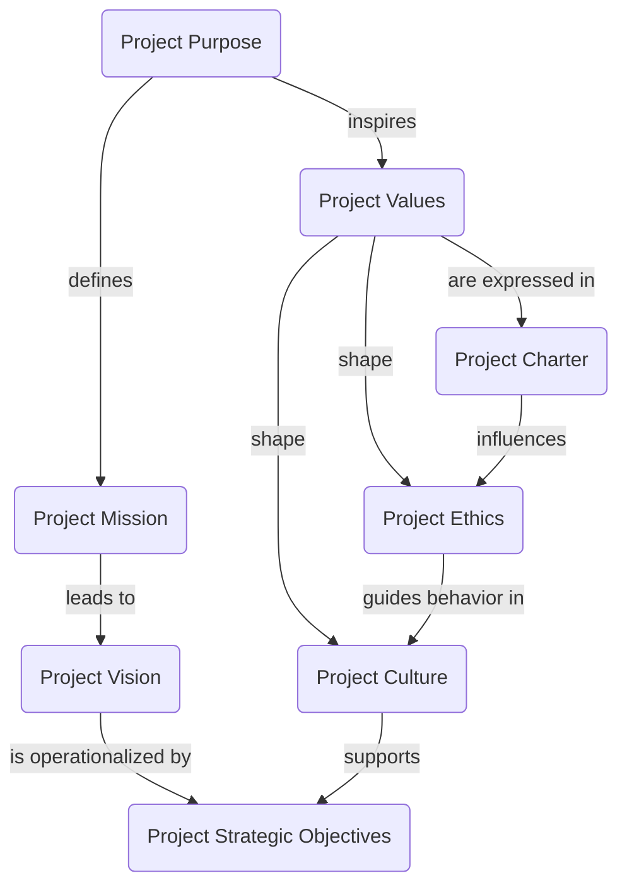

# Project foundation model

## Project purpose

Give Pi operators a truthful, low-friction inspection surface for the active session context.

## Project mission

Maintain the former local context-overlay workflow as a reusable monorepo package that can:

- register `/c` as the context inspector entrypoint
- render a bounded overlay for live session context, usage, and grouping
- open file-backed context items when available
- ship the `context-report` prompt for textual inspection
- stay compatible with Pi host lifecycle changes through package-local validation and documentation

## Ownership boundary

This package owns:

- the overlay command and extension wiring in `extensions/context-overlay.ts`
- overlay rendering, grouping, token estimation, and snapshot handling in `src/`
- package-local prompts, smoke examples, and handoff/compatibility notes

This package does **not** own:

- durable session history or replay
- generic interaction/runtime primitives that belong in `packages/pi-interaction`
- vault/package-distribution policy beyond its own release metadata and validation path

## Scope boundary

- **Organization purpose** lives at org level and is documented in [Organization operating model](../org/operating_model.md).
- **Project purpose** here is narrower: make live Pi context inspection reliable, understandable, and easy to maintain as its own package seam.
