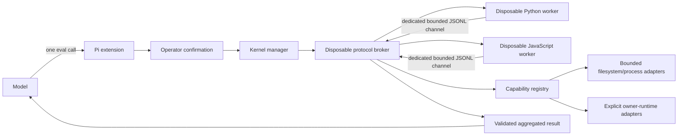

# Code-mode architecture

## Runtime flow

Each worker exchanges newline-delimited JSON with the host through a disposable protocol broker and a dedicated worker file descriptor. The broker bounds frame bytes and frame count before forwarding anything into the long-lived Pi host; unexpected direct worker stdout is rejected rather than interpreted as control traffic. The host validates every parsed frame at runtime.

An `eval_result` is provisional. After receiving one valid result, the host issues a fresh finalization token and commits only after a matching `eval_complete` frame, worker/broker exit, and zero outstanding capability calls. Direct process exit after a forged result therefore fails rather than committing state. User stdout/stderr is captured and bounded inside each worker. JSON-compatible `state` is retained by the host and supplied to the next disposable worker.

## One eval, multiple operations

The model issues one `eval` tool call. The selected worker can issue multiple registry calls, including concurrent calls through `tool.parallel`. The extension aggregates stdout, stderr, final value, timing, and capability-call metadata into one result.

This resembles Senpi's model-visible aggregation but deliberately uses an explicit registry rather than pretending stock Pi exposes arbitrary registered handlers.

## Registry contract

Every capability declares:

- stable lower-case snake-case name;
- human-readable description;
- effect class;
- typed owner implementation;
- invocation through a cwd, effect allowlist, and abort signal.

Duplicate or malformed names fail during extension construction. Unknown or unadmitted effects fail before adapter execution.

The registry is a composition boundary, not canonical authority. An ASC adapter must call ASC's public execution runtime; an orchestrator adapter must call the orchestrator's public runtime. Code mode must not reproduce their validation, concurrency, receipts, or lifecycle rules.

## Host compatibility contract

Pi host packages are optional peers, not persistent package dev dependencies. The root compatibility canary temporarily installs its selected exact host set and compiles `compat/pi-host-contract.ts`, which assigns the code-mode factory to the host's exported `ExtensionFactory`. Ordinary package installs therefore remain independent of host-internal shrinkwraps while the canary still detects `ExtensionAPI`, TypeBox schema, tool-result, and command-handler drift.

## Lifecycle

- Every eval receives a fresh worker process.
- Calls are serialized per language so host-committed logical state is deterministic.
- Python and JavaScript workers can run independently.
- Capability calls inside one eval can run concurrently and must settle before a normal worker result.
- Each eval owns an abort signal propagated to host capabilities.
- A capability still pending when its worker exits invalidates the eval immediately; the host does not wait forever for an adapter that ignores cancellation.
- Abort or timeout terminates the affected worker because arbitrary synchronous code cannot be safely interrupted in-process.
- Reset increments a lifecycle generation, kills active workers, invalidates already queued calls, and clears state.
- Session start resets both logical kernels; shutdown permanently closes them.

## Pi ownership boundary

Pi 0.83.0 coding-agent extensions can register tools, inspect tool metadata, and change the active set. They cannot safely invoke arbitrary registered tools by name.

`pi-eval-kernel` therefore requires no Pi change for its current behavior. A future universal dispatcher preserving host validation, hooks, cancellation, rendering, and durable harness records would belong to the upstream AgentHarness/extension-host API, not this package and not `pi-ai`.
