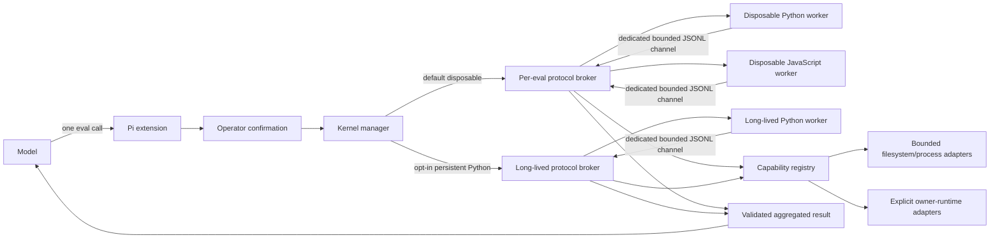

# Code-mode architecture

## Runtime flow

Each worker exchanges newline-delimited JSON with the host through a protocol broker and a dedicated worker file descriptor. The default disposable engine creates one broker/worker pair per eval. Opt-in persistent Python retains one broker/worker pair across serialized evals. Both broker forms bound frame bytes and reject unexpected direct worker stdout rather than interpreting it as control traffic; the host validates every parsed frame at runtime.

An `eval_result` is provisional. After receiving one valid result, the host issues a fresh finalization token and accepts only a matching `eval_complete` frame after outstanding capability calls settle. Disposable execution additionally completes its one-shot process lifecycle before committing host-retained JSON state. Persistent Python leaves the validated worker alive and retains its `state` dictionary in-process without a host round-trip. A forged result followed by direct or unexpected process exit therefore rejects instead of committing. User stdout/stderr remains captured and bounded inside each worker.

## One eval, multiple operations

The model issues one `eval` tool call. The selected worker can issue multiple registry calls, including concurrent calls through `tool.parallel`. The extension aggregates stdout, stderr, final value, timing, and capability-call metadata into one result.

This resembles Senpi's model-visible aggregation but deliberately uses an explicit registry rather than pretending stock Pi exposes arbitrary registered handlers.

## Registry contract

Every capability declares:

- stable lower-case snake-case name;
- human-readable description;
- effect class;
- typed owner implementation;
- invocation through a cwd, effect allowlist, and abort signal.

Duplicate or malformed names fail during extension construction. Unknown or unadmitted effects fail before adapter execution.

The registry is a composition boundary, not canonical authority. An ASC adapter must call ASC's public execution runtime; an orchestrator adapter must call the orchestrator's public runtime. Code mode must not reproduce their validation, concurrency, receipts, or lifecycle rules.

## Host compatibility contract

Pi host packages are optional peers, not persistent package dev dependencies. The root compatibility canary temporarily installs its selected exact host set and compiles `compat/pi-host-contract.ts`, which assigns the code-mode factory to the host's exported `ExtensionFactory`. Ordinary package installs therefore remain independent of host-internal shrinkwraps while the canary still detects `ExtensionAPI`, TypeBox schema, tool-result, and command-handler drift.

## Lifecycle

- The default disposable engine gives every Python and JavaScript eval a fresh worker. Opt-in persistent mode reuses one Python broker/worker pair; JavaScript remains disposable.
- Calls are serialized per language so logical state is deterministic. Python and JavaScript can run independently, while capability calls inside one eval can run concurrently and must settle before a normal result.
- Each eval owns an abort signal propagated to host capabilities. Persistent Python first uses `SIGINT` and retains the worker only after a result proves that interrupt was handled; escalation retires an unresponsive worker.
- `persistent-python-worker.ts` privately owns process spawn, bounded transport parsing, signaling, close observation, and one memoized retirement promise per exact broker. `persistent-python-client.ts` owns the serialized queue, lifecycle generation, active eval, capability bridge, and result metadata.
- Fatal active or idle transport failures, protocol errors, timeout escalation, and unexpected exits detach the exact worker by identity and register its retirement promise before rejecting active work. A replacement cannot spawn until the retirement gate confirms broker close.
- The first eval on every replacement reports `kernelReused: false`; successful reuse metadata is tied to worker identity rather than a global run flag.
- Reset captures the queue tail at invocation, increments the generation, begins exact worker retirement, rejects the active eval, and awaits both the captured tail and broker close. A later reset cannot allow an intervening stale generation to spawn.
- Close performs the same captured-tail drain and exact retirement after permanently rejecting new work. Session start resets both logical kernels; shutdown closes them.
- Native `win32` rejects persistent Python construction before broker spawn and never silently selects disposable execution. Native support requires verified worker-tree termination semantics first.

## Pi ownership boundary

Pi 0.83.0 coding-agent extensions can register tools, inspect tool metadata, and change the active set. They cannot safely invoke arbitrary registered tools by name.

`pi-eval-kernel` therefore requires no Pi change for its current behavior. A future universal dispatcher preserving host validation, hooks, cancellation, rendering, and durable harness records would belong to the upstream AgentHarness/extension-host API, not this package and not `pi-ai`.
