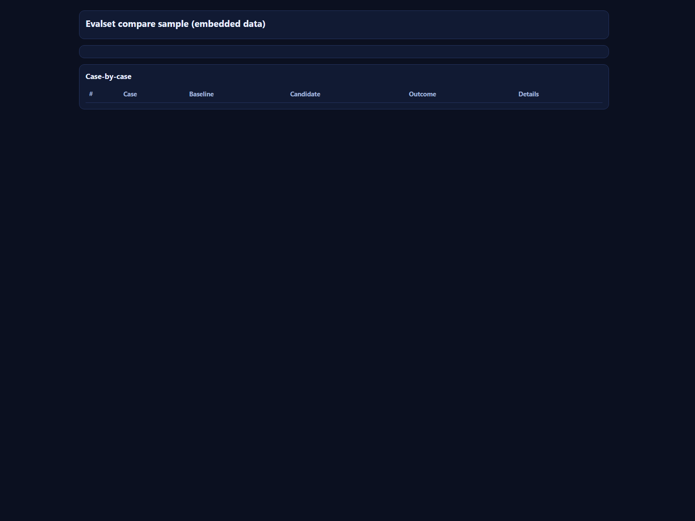

# @tryinget/pi-evalset-lab

Monorepo package for fixed-task-set eval workflows in Pi (`/evalset run|compare`) with reproducible JSON reports and static HTML export.

- Workspace path: `packages/pi-evalset-lab`
- Release component key: `pi-evalset-lab`
- Legacy standalone source: `~/programming/pi-extensions/pi-evalset-lab`
- Canonical package status: canonicalized here; legacy repo still needs the standard deprecation workflow before archive/delete.

Primary category fit: **Model & Prompt Management**, **Review & Quality Loops**, **UX & Observability**, **Safety & Governance**.

## Runtime dependencies and packaged files

This package expects Pi host runtime APIs and declares them as `peerDependencies`:

- `@mariozechner/pi-coding-agent`
- `@mariozechner/pi-ai`

The npm package uses a `files` whitelist so required runtime artifacts are explicitly included:

- `extensions/evalset.ts`
- `prompts/`
- `examples/` (sample datasets + sample report UI)
- `scripts/export-evalset-report-html.mjs`

## Quickstart

Install package dependencies for local validation:

```bash
cd packages/pi-evalset-lab
npm install
npm run check
```

Install into Pi from the package directory containing `package.json`:

```bash
pi install /absolute/path/to/pi-extensions/packages/pi-evalset-lab
# then in Pi: /reload
```

For ad hoc source testing from this package directory:

```bash
pi -e ./extensions/evalset.ts
```

## evalset command

```bash
/evalset help
/evalset init [dataset-path] [--force]
/evalset run <dataset.json> [--system-file <path>] [--system-text <text>] [--variant <name>] [--max-cases <n>] [--temperature <n>] [--out <report.json>]
/evalset compare <dataset.json> <baseline-system.txt> <candidate-system.txt> [--baseline-name <name>] [--candidate-name <name>] [--max-cases <n>] [--temperature <n>] [--out <report.json>]
```

`/evalset` is a Pi slash command, not a shell executable.

Interactive mode:

```bash
pi -e ./extensions/evalset.ts
# then inside Pi:
/evalset compare examples/fixed-task-set.json examples/system-baseline.txt examples/system-candidate.txt
```

Non-interactive mode:

```bash
pi -e ./extensions/evalset.ts -p "/evalset compare examples/fixed-task-set.json examples/system-baseline.txt examples/system-candidate.txt"
# or, if installed/enabled:
pi -p "/evalset compare examples/fixed-task-set.json examples/system-baseline.txt examples/system-candidate.txt"
```

Interactive sessions use Pi UI hooks (`ctx.ui`) for status/notify updates. Non-interactive `-p` mode skips those UI calls when `ctx.hasUI === false`.

## Included datasets and sample output

- `examples/fixed-task-set.json` — tiny smoke set (3 cases)
- `examples/fixed-task-set-v2.json` — larger first pass set
- `examples/fixed-task-set-v3.json` — less brittle checks (recommended)
- `examples/evalset-compare-sample-embedded.html` — self-contained report UI with embedded compare JSON
- `examples/evalset-compare-sample.png` — screenshot preview of that HTML report
- `examples/system-baseline.txt` and `examples/system-candidate.txt` — compare inputs

Preview:



Reports are written to explicit `--out <path>` when provided, otherwise `.evalset/reports/*.json` under the current project directory.

Each report includes run identity metadata (`runId`, `datasetHash`, `casesHash`, and variant hashes). Session messages keep lightweight report metadata only, not full report bodies.

## Export report JSON to static HTML

```bash
npm run evalset:export-html -- --in .evalset/reports/compare-your-dataset-YYYYMMDDTHHMMSS.json
# optional:
npm run evalset:export-html -- --in .evalset/reports/run-your-dataset-YYYYMMDDTHHMMSS.json --out .evalset/reports/run-your-dataset.html --title "Evalset run report"
```

Script: [scripts/export-evalset-report-html.mjs](scripts/export-evalset-report-html.mjs)

## Validation and release checks

Package-local validation:

```bash
npm run check
npm run release:check:quick
```

Monorepo-scoped validation:

```bash
cd ../..
bash ./scripts/package-quality-gate.sh ci packages/pi-evalset-lab
node ./scripts/release-components.mjs validate
```

Release metadata is root-managed through `x-pi-template.releaseConfigMode=component` and component key `pi-evalset-lab`.

## Optional core hooks (future, not required)

This extension works today without Pi core changes. Optional hardening could include stable agent-level lineage IDs, explicit reproducibility metadata in `pi-ai`, shared provider payload hashing, or a headless agent-eval API for tool-heavy/full agent-loop benchmark runs.
