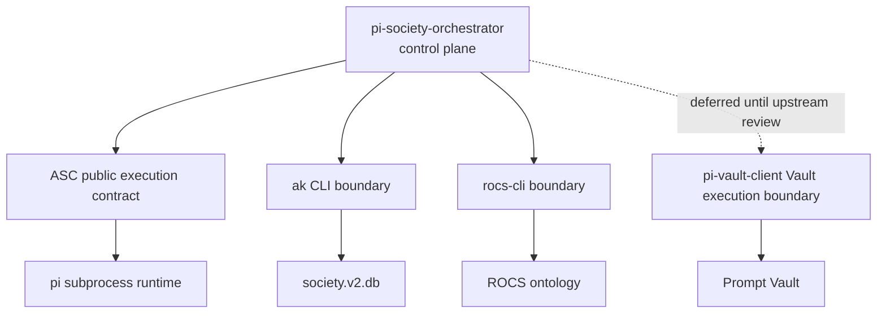

# ADR — Control-plane boundaries for `pi-society-orchestrator`

## Status

Proposed.

## Executive summary

`pi-society-orchestrator` should become a **coordination/control-plane package**, not a second implementation of prompt-vault access, society-state access, ontology access, or subagent execution.

The architecture target is:

- `ak` owns society-state access
- `rocs-cli` owns ontology access
- `pi-vault-client` owns prompt-vault access and prompt governance
- `pi-autonomous-session-control` (ASC) owns execution-plane / subagent runtime concerns
- `pi-society-orchestrator` owns loops, sequencing, routing, escalation, and synthesis across those systems

This ADR does **not** yet force one exact code-level seam for every dependency. It does establish the ownership model, allowed dependency directions, prohibited coupling patterns, architecture fitness functions, and migration order.

Sequencing note:
- the **prompt-plane seam** should be finalized only after the planned `pi-vault-client` NEXUS change lands: one explicit Vault execution boundary owning company-context resolution, shared template preparation, scoped persistence, and clean-room packaged-artifact smoke coverage
- until that upstream boundary is implemented and reviewed, `pi-society-orchestrator` should proceed on all non-prompt-plane work and treat prompt-plane seam choice as intentionally pending rather than unresolved by neglect

Long-term convergence note:
- this ADR still governs the **current** package boundary truth: orchestrator remains the control-plane package and ASC remains the execution-plane owner
- the broader target architecture is now captured in `~/ai-society/softwareco/owned/agent-kernel/docs/project/2026-03-21-rfc-governed-delegated-cognition-runtime.md`
- that RFC defines a future Pi-native governed delegated cognition runtime as the orchestration V3 target, with Pi as the outer host runtime, DSPy as a first-class inner cognition runtime where selected, DSPx as the engineering/analysis layer, and AK as canonical runtime/lineage authority over the durable substrate in `society.v2.db`
- until that future target is accepted and implemented, this ADR's ownership split remains the local architectural baseline for `pi-society-orchestrator`

## Expert review synthesis

This proposal was strengthened using three domain lenses:

### 1. Principal Systems Architect
Primary concern: keep package responsibilities singular and the dependency graph acyclic.

Contribution to this ADR:
- insist on one owner per capability plane
- separate control-plane concerns from execution/data-plane concerns
- require a published dependency DAG before code migration

### 2. Platform Interface & Contract Architect
Primary concern: package reuse must happen through explicit public seams, not private source imports or text parsing.

Contribution to this ADR:
- define allowed seam types and their priority order
- require canonical compatibility truth from owning packages
- treat public exports / CLI boundaries / stable tool contracts as first-class integration options

### 3. Autonomous Runtime Reliability Architect
Primary concern: subagent execution is operational infrastructure and should not be duplicated casually.

Contribution to this ADR:
- designate ASC as the current strongest execution-plane reference
- require additive, reversible migration rather than big-bang replacement
- tie migration to harnesses, invariants, and rollback points

## Context

`pi-society-orchestrator` was imported from a live brownfield extension and currently overlaps with existing canonical systems:

- `ak` already exists as the society-state boundary
- `rocs-cli` already exists as the ontology boundary
- `pi-vault-client` already exists as the Prompt Vault boundary
- ASC already provides the strongest execution-plane / subagent runtime package in this monorepo

Current package evidence:
- `pi-society-orchestrator` README frames the package as multi-agent orchestration, but the current code still contains local raw access patterns and local dispatch logic.
- ASC has already adopted an Edge Contract Kernel (ECK) and owns `dispatch_subagent`, session lifecycle, and reliability hardening.
- `pi-vault-client` already owns Prompt Vault schema-v9 diagnostics, retrieval/mutation surfaces, and execution-time render semantics.
- Monorepo root capability rules explicitly keep package-local implementation contracts at the package level, not at root.

Without a boundary ADR, `pi-society-orchestrator` will continue to grow duplicate local implementations for concerns that already have an owner elsewhere.

## Problem statement

The current architecture has three failure modes:

1. **Ownership drift**
   - orchestrator behaves as if it owns coordination, execution, and data access simultaneously
2. **Coupling drift**
   - downstream packages can be tempted to reimplement or privately import behavior instead of consuming a supported seam
3. **Truth drift**
   - compatibility, schema, and behavioral assumptions can diverge across packages when not sourced from canonical owners

The result is a system that looks integrated socially but is not yet integrated architecturally.

## Decision drivers

1. **Single ownership per capability plane**
2. **Acyclic dependency graph**
3. **Public seams over private imports**
4. **Reversible migration path**
5. **Operational reliability over convenience duplication**
6. **Package-local contracts remain package-local unless intentionally extracted**
7. **Canonical diagnostics must outrank duplicated local assumptions**

## Decision

Treat `pi-society-orchestrator` as a **control-plane / coordination package**, not a raw data-access or execution-runtime owner.

### Phase A UI/runtime ownership matrix

Phase A capability discovery across upstream Pi, `pi-interaction`, ASC, and `pi-vs-claude-code` resolved the presentation/runtime split like this:

| Plane | Canonical owner today | Evidence | Explicit non-goals | Resulting rule |
|---|---|---|---|---|
| Generic extension UI primitives | Upstream Pi / `pi-mono` | `extensions.md`, extension examples, `packages/tui/README.md` | trigger brokering, subagent lifecycle | Consume directly; do not invent a new wrapper package by default |
| Interaction runtime | `pi-interaction` | package split docs + editor registry + picker/selection runtime | global widget/footer ownership; execution runtime | Use it for editor/trigger/picker behavior, not as a catch-all UI owner |
| Execution runtime | ASC | `README.md` capability inventory | generic widget/footer ownership; prompt-vault governance | Keep subagent runtime ownership in ASC; prefer an ASC public contract first |
| UX/pattern reference | `pi-vs-claude-code` | widget/footer/overlay examples | canonical runtime ownership | Borrow patterns only |
| Coordination/control plane | `pi-society-orchestrator` | this ADR + backlog direction | raw data access, prompt-vault governance, execution runtime | Own loops, sequencing, escalation, synthesis |

Implications of Phase A:

- generic widgets, footers, overlays, and custom editors are already upstream Pi capabilities
- `pi-interaction` should remain the owner of interaction-runtime-specific behavior
- `pi-vs-claude-code` should inform UX choices without becoming an architectural owner
- there is **not yet** enough evidence to justify a dedicated UI-helper package for orchestrator

### Capability ownership

| Capability | Canonical owner | Why this owner | Expected orchestrator role |
|---|---|---|---|
| Society-state access | `ak` | This is the authoritative system boundary for tasks, evidence, models, and society DB operations | Consume through canonical `ak` commands/contracts |
| Ontology access | `rocs-cli` | Ontology truth should remain in ROCS, not in an accidental local SQL shape | Consume ontology context through ROCS-facing seam |
| Prompt-vault access and governance | `pi-vault-client` | It already owns schema-v9 compatibility, query/retrieve/mutate/diagnostics, and render semantics | Consume prompts/diagnostics through a supported `pi-vault-client` seam |
| Subagent execution runtime | ASC | It already owns `dispatch_subagent`, prompt envelope application, session lifecycle, invariants, dashboards, and test depth | Reuse ASC execution behavior rather than maintain a parallel runtime |
| Coordination intelligence | `pi-society-orchestrator` | This is the package’s differentiator and correct abstraction layer | Own loops, sequencing, routing, escalation, evidence intent, synthesis |

### Presentation-helper extraction rule

Do **not** create a dedicated orchestrator UI-helper package yet.

Preferred order:

1. consume upstream Pi UI primitives directly
2. use `pi-interaction` only when interaction-runtime semantics are actually required
3. keep orchestrator-local presentation glue local until at least two real consumers exist and upstream Pi primitives still leave a proven gap

### Operating model by plane

#### Data plane
Owned by the underlying systems of record:
- Prompt Vault
- `society.v2.db`
- ROCS

#### Adapter plane
Owned by canonical access boundaries:
- `pi-vault-client`
- `ak`
- `rocs-cli`

#### Execution plane
Owned by ASC.

#### Control plane
Owned by `pi-society-orchestrator`.

## Allowed seam types and priority order

When `pi-society-orchestrator` consumes another package or system capability, prefer seams in this order:

1. **Public package/runtime contract**
   - best when the dependency is package-to-package and deterministic
2. **Canonical CLI boundary**
   - best when the underlying system already exposes a stable process contract (`ak`, `rocs-cli`)
3. **Stable structured tool contract**
   - acceptable when the package is intentionally consumed at the tool surface and machine-readable details are sufficient

### Seam selection rules

- Pick the **highest-fidelity seam that is already supported**.
- If a needed seam is missing, create or extract one intentionally.
- Do **not** treat private internal source files as the integration API.
- Do **not** rely on parsing human-oriented text output where a structured contract can exist.

## Dependency direction policy

Preferred interaction shape:

```text
Prompt Vault / society.v2.db / ROCS
        ↑           ↑           ↑
   pi-vault-client   ak      rocs-cli
          ↑
pi-autonomous-session-control
          ↑
pi-society-orchestrator
```

### Dependency DAG (target)



Interpretation:
- `pi-society-orchestrator` may depend on canonical lower-plane seams.
- ASC must not depend on `pi-society-orchestrator`.
- `pi-vault-client` must not depend on `pi-society-orchestrator`.
- Cross-package cycles are forbidden.

## Consumer/provider seam matrix

| Consumer | Provider | Allowed seam(s) | Forbidden seam(s) | Notes |
|---|---|---|---|---|
| `pi-society-orchestrator` | `ak` | canonical CLI / explicit adapter wrapper | raw `sqlite3` against society DB as primary path | Keep read/write intent explicit |
| `pi-society-orchestrator` | `rocs-cli` | canonical CLI / explicit ROCS wrapper | local ontology SQL/table contract as primary path | Avoid accidental ontology schema ownership |
| `pi-society-orchestrator` | `pi-vault-client` | public runtime export, extracted shared runtime, or stable structured tool contract **after** the upstream Vault execution boundary lands and is reviewed | raw `dolt sql`; private `../pi-vault-client/src/*` imports | Prompt-plane ownership stays in vault-client; final seam selection is intentionally deferred until the new upstream boundary exists |
| `pi-society-orchestrator` | ASC | public execution contract or extracted execution runtime | copied spawn/session logic; private `../pi-autonomous-session-control/extensions/self/*` imports | Execution-plane ownership stays in ASC |
| ASC | `pi-vault-client` | stable prompt-envelope-compatible seam | duplicated prompt governance logic | Existing integration precedent already exists |
| any downstream package | owning package diagnostics | canonical machine-readable diagnostics | duplicated local compatibility constants as long-term truth | Prefer one source of compatibility truth |

## Prohibited patterns

`pi-society-orchestrator` should not add or preserve as long-term architecture:

- raw Prompt Vault access when `pi-vault-client` owns the boundary
- raw society DB access when `ak` owns the boundary
- raw ontology DB/table assumptions when `rocs-cli` owns the boundary
- a second long-term subagent runtime that competes with ASC
- private source-path imports across package internals as the primary integration mechanism
- duplicated compatibility truths when canonical diagnostics already exist elsewhere

## Architecture fitness functions

The architecture should be considered **non-compliant** if any of the following become true without an explicit exception ADR:

1. `pi-society-orchestrator` contains direct `sqlite3` invocation as a primary backend path.
2. `pi-society-orchestrator` contains direct `dolt sql` invocation as a primary backend path.
3. `pi-society-orchestrator` imports private internals from:
   - `../pi-vault-client/src/*`
   - `../pi-autonomous-session-control/extensions/self/*`
4. Orchestrator retains two divergent dispatch implementations after the execution-plane seam is chosen.
5. Downstream compatibility logic hardcodes vault/schema truth that differs from canonical diagnostics.
6. A new cross-package dependency introduces a cycle.

### Intended future enforcement

These fitness functions should later become deterministic checks in CI or package-level tests where practical.

## Alternatives considered

### A. Keep `pi-society-orchestrator` as a full-stack orchestrator
Meaning: let it own coordination, raw data access, vault access, and dispatch runtime locally.

Why rejected:
- maximizes duplication
- hides ownership drift under convenience
- creates the highest long-term maintenance cost
- directly competes with capabilities already proven elsewhere in the monorepo

### B. Integrate by private cross-package source imports
Meaning: orchestrator directly imports internals from ASC or `pi-vault-client` source trees.

Why rejected:
- creates hidden coupling
- bypasses package contracts and version discipline
- makes later extraction or publishing harder
- conflicts with the monorepo’s existing package-surface discipline

### C. Control-plane orchestrator over canonical owners (**chosen**)
Meaning: orchestrator owns coordination logic only and consumes lower-plane capabilities through supported seams.

Why chosen:
- best separation of concerns
- aligns with existing package strengths
- minimizes architectural overlap
- allows phased migration without demanding a single big-bang implementation

## Consequences

### Positive
- Stronger separation of concerns
- Less duplication across package boundaries
- Clearer migration path from brownfield orchestrator code to canonical monorepo roles
- Lower risk of drift between direct and looped orchestration behavior
- Better chance of introducing durable tests at package seams rather than only inside packages

### Costs
- orchestrator refactor work becomes contract-heavy rather than purely local
- some existing local helpers will need deprecation or replacement
- at least one public non-UI seam is still needed from `pi-vault-client`
- ASC may need a clearer public execution contract if orchestrator is to depend on it directly

### Risks
- migration can stall if seam design is deferred too long
- partial adoption can create split-brain behavior during transition
- package teams may disagree on whether reuse should happen through exports vs CLI vs tool contracts

### Mitigations
- adopt a strangler rollout with seam-level rollback points
- publish the dependency DAG and seam matrix before major code movement
- gate migration with focused harnesses and invariant checks

## Non-goals

This ADR does **not**:

- choose the final implementation details of every public seam
- remove all legacy paths immediately
- define the final test harness implementation in this document
- redefine monorepo root capability ownership
- collapse all package responsibilities into a shared mega-runtime

## Open decision points

### 1. Execution-plane integration shape
**Decision: choose an ASC-owned public execution contract first.**

Chosen path:
1. ASC promotes a **public execution contract** for non-UI consumers.
2. `pi-society-orchestrator` consumes that contract.
3. Extraction into a smaller shared runtime package remains a fallback only if the ASC-owned contract cannot be made clean without leaking `self`-specific concerns.

Why this path wins now:
- preserves single ownership of the execution plane in ASC
- reuses the package that already has the strongest lifecycle, invariant, and test coverage
- minimizes immediate package/release churn versus creating a new shared package too early
- keeps extraction available as a second move once actual reuse pressure is proven rather than guessed

Required shape of the ASC public execution contract:
- no private imports from `extensions/self/*` by consumers
- package-level public entrypoint or export surface
- explicit types for dispatch inputs/results and lifecycle state where needed
- separation between runtime primitives and extension registration glue
- compatibility with existing `dispatch_subagent` reliability behavior and tests

Fallback trigger for extraction:
- if establishing the ASC public contract would couple orchestrator to `self` domain concepts, package-local extension bootstrapping, or release semantics that should remain private, then extract a smaller execution runtime package derived from ASC.

Decision criteria:
- public contract clarity
- release/versioning burden
- testability outside Pi runtime
- ability to preserve ASC’s current reliability features
- absence of `self`-specific leakage into the consumer-facing execution seam

### 2. Prompt-plane integration shape
**Status: intentionally deferred until the upstream `pi-vault-client` Vault execution boundary is implemented and reviewed.**

After that boundary lands, choose one:
1. `pi-vault-client` exposes a public runtime export for non-UI consumers.
2. A small shared prompt-runtime package is extracted.
3. Structured tool-contract consumption remains the supported automation boundary.

Decision criteria:
- whether package consumers need deterministic code-level access
- whether tool-level structured details are already sufficient
- whether the seam can be versioned without copying vault semantics into multiple places
- whether the new upstream boundary fully owns company-context resolution, shared preparation, scoped persistence, and packaged-artifact smoke coverage as intended

### 3. Compatibility truth source
Decision required:
- which package/system becomes the canonical machine-readable source for prompt-vault compatibility expectations across downstream consumers?

Default direction recommended by this ADR:
- source compatibility truth from the owning package/system diagnostics, not from duplicated constants in downstream packages.

## Worked end-to-end example

### Example: strategic loop with canonical lower-plane owners

Goal: run a strategic orchestration flow that needs a cognitive prompt, subagent execution, society evidence, and ontology context.

1. **Control plane (`pi-society-orchestrator`)**
   - decides loop type, phase sequence, and desired intervention
2. **Prompt plane (`pi-vault-client`)**
   - retrieves a prompt or framework grounding artifact through the supported prompt seam
3. **Execution plane (ASC)**
   - applies prompt-envelope semantics and runs `dispatch_subagent` through the canonical execution seam
4. **Society-state adapter (`ak`)**
   - records or queries task/evidence/model state through the canonical society boundary
5. **Ontology adapter (`rocs-cli`)**
   - retrieves ontology context through the canonical ontology boundary
6. **Control plane (`pi-society-orchestrator`)**
   - synthesizes outputs, updates loop state, and decides next action

### Why this example matters

It demonstrates that orchestrator still coordinates the whole experience without needing to own any lower-plane implementation details.

## Migration policy

### Phase 1 — Clarify
- approve this ADR
- publish the dependency DAG + seam matrix
- decide the **execution-plane** seam shape now
- explicitly mark the **prompt-plane** seam shape as pending the upstream `pi-vault-client` Vault execution boundary

### Phase 2 — Map
- inventory all current orchestrator raw access points and local duplicate runtime paths
- map society-state and ontology paths immediately to canonical owners/seams
- map prompt-plane paths to a temporary holding bucket pending upstream boundary completion

### Phase 3 — Strangle
- migrate one boundary family at a time:
  - execution-plane
  - society-state
  - ontology
  - prompt-vault **after upstream boundary review**
- keep rollback points at each seam
- do not migrate multiple planes in one opaque change when avoidable

### Phase 4 — Harden
- add seam-level harnesses and invariant checks
- review the implemented upstream `pi-vault-client` boundary
- finalize prompt-plane seam choice
- remove deprecated local duplicate paths only after replacement behavior is proven

## Review triggers

Revisit this ADR when any of the following occur:

- a new cross-package dependency is proposed
- a package wants to bypass a canonical owner for convenience
- a public seam is extracted or versioned for the first time
- canonical diagnostics change in a way that affects downstream compatibility logic
- the first migration of prompt-plane or execution-plane ownership lands
- the ASC public execution contract proposal shows `self`-specific leakage that may force extraction

## Acceptance criteria for declaring this architecture active

All of the following must be true:

1. `pi-society-orchestrator` README and tool descriptions reflect a coordination-plane charter.
2. A published dependency DAG + seam matrix exists.
3. Orchestrator no longer treats raw society/ontology access as its primary architecture.
4. Execution-plane behavior is sourced from an ASC-owned public execution contract or, if that fails the decision tests, from an extracted shared runtime derived from ASC.
5. The implemented upstream `pi-vault-client` Vault execution boundary has been reviewed and the prompt-plane seam is chosen against that reality.
6. Cross-package compatibility checks read from canonical diagnostics rather than duplicated local truth.
7. Migration harnesses cover the chosen public seams.
8. The architecture fitness functions are either passing or explicitly waived by follow-up decision.

## Validation

Keep this ADR consistent with:
- `README.md`
- `../pi-autonomous-session-control/docs/project/nexus-native-addition.md`
- `../pi-autonomous-session-control/docs/project/prompt-vault-integration-plan.md`
- `../pi-autonomous-session-control/README.md`
- `../pi-vault-client/README.md`
- `../../docs/project/root-capabilities.md`

Validation command:

```bash
npm run check
```
