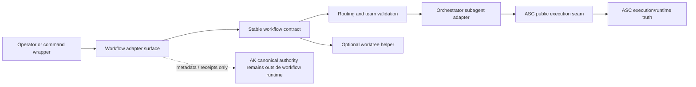

# RFC — chain / parallel / worktree UX over ASC

## Decision in one sentence

Build a **thin orchestrator-native workflow layer** for chain, parallel, and optional worktree fan-out behavior **above** ASC's public execution seam, with a small package-local workflow contract as the stable core and commands/UI/persistence treated as adapters.

## Scope

This RFC proposes the **orchestrator-side** landing for the remaining useful coordination UX currently found in contrib `pi-subagents`.

In scope:

- chain workflows
- parallel workflows
- optional worktree fan-out UX for parallel steps
- optional manager/builder UX if still justified after thin workflow surfaces exist
- a package-local stable workflow contract that commands/UI can adapt to

Out of scope:

- execution/runtime ownership
- prompt-plane ownership
- peer-session messaging transport
- contrib file-backed agent/chain registry as current owned truth
- AK authority changes

## Current boundary

Current owned reality is already:

- ASC owns subagent execution/runtime behavior
- orchestrator consumes ASC through `createAscExecutionRuntime(...)`
- orchestrator already owns coordination/control-plane behavior such as loops and routing
- AK remains canonical authority/runtime truth outside the local package coordination surface

Primary package-local boundary anchors:

- [subagent-execution-boundary-map.md](subagent-execution-boundary-map.md)
- [execution seam charter](2026-03-31-execution-seam-charter.md)
- [runtime status semantics](runtime-status-semantics.md)
- `src/runtime/subagent.ts`

Interpretation rule:

This RFC does **not** reopen whether subagent execution should live in orchestrator.
It should not.

## Problem framing

After the orchestrator→ASC cutover, the owned stack still lacks a truthful orchestrator-native UX for several useful coordination patterns that contrib `pi-subagents` explored:

- run this sequence of delegated steps
- run these delegated tasks in parallel
- optionally isolate parallel tasks in worktrees
- maybe provide a thin operator-facing builder/manager for those flows later

The absence of that UX does **not** imply a missing execution kernel.
It implies a missing **control-plane UX layer above** the kernel.

### Evidence backing the framing

High-signal evidence for that claim:

- contrib prior art exists for these UX concerns:
  - `softwareco/contrib/pi-subagents/slash-commands.ts`
  - `softwareco/contrib/pi-subagents/chain-execution.ts`
  - `softwareco/contrib/pi-subagents/worktree.ts`
  - `softwareco/contrib/pi-subagents/agent-manager.ts`
  - `softwareco/contrib/pi-subagents/agent-manager-parallel.ts`
- owned boundary docs already establish that execution itself is extracted into ASC:
  - [subagent-execution-boundary-map.md](subagent-execution-boundary-map.md)
  - [execution seam charter](2026-03-31-execution-seam-charter.md)
  - [ASC public execution contract](../../pi-autonomous-session-control/docs/project/public-execution-contract.md)
- the contrib salvage review already classified the remaining missing concerns as coordination UX and peer messaging rather than execution runtime:
  - [`../../../../docs/project/2026-04-22-subagent-contrib-salvage-boundary-status.md`](../../../../docs/project/2026-04-22-subagent-contrib-salvage-boundary-status.md)

### Evidence limits

There is still **insufficient evidence** that higher-order manager/builder UX should be part of the first slice.
That is why this RFC treats manager/builder work as explicitly deferred and requires the thinner workflow surfaces to earn it.

### Why existing loops do not already solve this

`loop_execute` already covers **phase-driven cognitive workflows** such as OODA, Kaizen, ADKAR, and Transcendent.
Those loops are:

- plugin-defined
- phase-based
- centered on one loop model and one objective

The missing surface here is different:

- arbitrary operator-assembled multi-step sequences
- explicit parallel fan-out/fan-in across delegated runs
- optional repo worktree isolation for parallel code-changing runs
- a thin reusable workflow surface that is not itself a cognitive loop family

So this RFC is not duplicating loops.
It is proposing a separate workflow-composition layer above the same execution owner.

## Existing package reality and constraints

The first slice must build on what the package actually owns today.

### Current agent/routing model

Current package-local routing and agent semantics are intentionally narrow:

- agent profiles: `scout`, `builder`, `reviewer`, `researcher`
- routing teams: `full`, `explore`, `implement`, `quality`

Anchors:

- `src/runtime/agent-profiles.ts`
- `src/runtime/agent-routing.ts`
- `/agents-team`

Interpretation:

- the first workflow surface should constrain itself to this current owned model
- richer agent-definition persistence is **not** assumed in this RFC
- if a later slice needs a broader agent model, that should be an explicit follow-on decision rather than implicit drift

### Current `src/chains.yaml` status

The package currently ships `src/chains.yaml`.
For this RFC it should be treated as:

- **historical/dormant package content**, not current authoritative workflow runtime truth
- **not** the stable core contract for this RFC
- potentially a future **adapter input** or migration seed only after the thin structured core lands and proves useful

Decision for this RFC:

- do **not** treat `src/chains.yaml` as the authority model
- do **not** promise automatic activation or compatibility in Slice A
- if later reused, it must be explicitly described as an adapter over the stable workflow contract rather than as the contract itself

## Prior art worth salvaging from contrib

The main useful prior art is not the contrib monolith itself, but these concern slices:

- slash/command workflow ergonomics
- chain and parallel request shapes
- fan-out/fan-in thinking for multi-step work
- worktree-assisted parallel isolation
- compact operator-facing launch/build flows

Useful evidence sources:

- `softwareco/contrib/pi-subagents/slash-commands.ts`
- `softwareco/contrib/pi-subagents/chain-execution.ts`
- `softwareco/contrib/pi-subagents/worktree.ts`
- `softwareco/contrib/pi-subagents/agent-manager.ts`
- `softwareco/contrib/pi-subagents/agent-manager-parallel.ts`

## What should **not** be salvaged as target architecture

Do **not** carry forward these contrib assumptions as owned truth:

- one monolithic subagent package that mixes runtime, orchestration, worktree, messaging, and prompt glue
- file-backed `.md` / `.chain.md` registry as the primary owned authority for orchestrator behavior
- prompt-template event-bridge glue as the workflow substrate
- private runtime coupling between orchestration logic and execution implementation

## Options considered

| Option | Description | Strengths | Risks / reasons not preferred |
|---|---|---|---|
| **A. Thin structured workflow core over ASC** **(preferred)** | Define a small package-local workflow request/result contract and execute it through existing orchestrator routing + ASC seam | Preserves execution ownership, is testable, keeps commands/UI as adapters, avoids monolith revival | Requires explicit contract definition and migration discipline |
| B. Saved workflow registry first | Start with persisted workflow artifacts (`.chain.md`, YAML, etc.) and make those the main user surface | Familiar to contrib users, potentially convenient for operators | Prematurely elevates persistence format into authority, imports contrib assumptions too early |
| C. Extract a shared workflow helper/package first | Create a generic package before orchestrator proves the need locally | May look cleaner for reuse | Insufficient evidence for a second real consumer; risks abstraction before proof |
| D. Keep current state and rely on loops only | No new workflow surface; direct users to existing loop and dispatch paths | Zero migration cost | Does not address the identified fan-out/fan-in and worktree UX gap |
| E. Port contrib `pi-subagents` wholesale | Reuse the existing contrib package architecture | Fastest apparent path to lots of features | Recreates the monolith and violates current owned boundaries |

Preferred direction:

- choose **Option A** now
- explicitly reject **Option E**
- defer **Options B/C** until the thin core proves the real pressure for persistence or extraction

## Decision drivers

- preserve the already-landed ASC/orchestrator execution boundary
- recover chain / parallel / worktree coordination UX without reviving a monolith
- keep the stable core smaller than any command, builder, or persistence format
- avoid promoting convenience persistence into authority too early
- avoid premature shared-package extraction before a second real consumer exists
- keep loops and workflow composition distinct unless later evidence proves they should converge
- make rollback to the current direct-dispatch + loops posture simple and truthful

## Architectural stance

This RFC takes a deliberately constrained stance derived from three competing architectural pressures:

1. **authority-bearing surfaces should stay small**
   - the first accepted surface should be the smallest workflow contract that can remain stable while preserving ASC execution ownership
2. **operator usability matters, but should arrive as adapters over the core**
   - command wrappers, builder flows, and saved workflows may become valuable, but they should not define the authority model of the first slice
3. **reuse pressure should be proven, not assumed**
   - a shared workflow helper or broader convergence with loop/plugin systems should wait until evidence shows that the local orchestrator surface is not the right permanent home

The resulting stance is:

- establish a thin orchestrator-local workflow core now
- keep commands/UI/persistence clearly subordinate to that core
- keep loops as a distinct family for now
- defer shared extraction until another real consumer proves the pressure

## Decision synthesis

This RFC was revised by forcing three strong architectural instincts into direct confrontation:

1. **boundary discipline**
   - preserve ASC execution ownership and prevent convenience surfaces from becoming authority
2. **workflow ergonomics pragmatism**
   - recover the useful operator-facing chain / parallel / worktree capabilities that contrib `pi-subagents` made legible
3. **premature generalization pressure**
   - avoid locking the package into a contrib-style registry model, builder-first model, or shared-engine extraction before evidence justifies it

The accepted synthesis is:

- side with **boundary discipline** for the stable core and execution seam
- side with **workflow ergonomics pragmatism** for the first public adapters
- reject **premature generalization pressure** as a first-slice driver unless later evidence proves the orchestrator-local workflow core is too narrow or too local

That synthesis is why this RFC keeps all three of the following true at once:

- ASC remains the only execution/runtime owner
- orchestrator still gains chain / parallel / optional worktree UX where it belongs
- commands, builders, and persistence remain adapters over the workflow core rather than the authority model itself

## Why this direction beats the alternatives

### Why not persistence-first

A saved-workflow-first design is tempting because contrib `pi-subagents` made `.chain.md` and related artifacts feel natural.
But starting there would give the persistence shape too much authority too early.

This RFC therefore treats saved workflows as a **possible later adapter**, not the first authority-bearing surface.

### Why not builder-first

A builder or manager UI may eventually be valuable, but there is still insufficient evidence that it belongs in the first slice.
If it lands before the workflow core is proven, the UI risks becoming the architecture.

This RFC therefore requires the thinner workflow surfaces to earn any builder/manager follow-on.

### Why not force the concern into existing loops

The current loop family is oriented around phase-driven cognitive execution.
The missing concern here is different:

- arbitrary multi-step workflow composition
- explicit parallel fan-out/fan-in
- optional worktree isolation for parallel code-changing runs

So this RFC keeps loops and workflow composition separate unless later evidence proves convergence is the better long-term architecture.

### Why not extract a shared workflow engine first

There is still insufficient evidence for a second real consumer.
Extracting a generic workflow helper now would optimize for hypothetical reuse rather than current truthful ownership.

This RFC therefore keeps the first workflow core local to orchestrator and makes later extraction conditional on real pressure.

### Why not port contrib `pi-subagents`

A wholesale port would immediately reintroduce the failure pattern this RFC is meant to avoid:

- execution/runtime
- orchestration UX
- persistence
- potentially messaging and prompt glue

collapsing back into one package family.

The preferred direction instead salvages only the coordination UX, while preserving the current owned boundaries.

## Preferred direction

## 1. Keep the execution boundary exactly where it is

All delegated step execution should continue to go through:

- `src/runtime/subagent.ts`
- ASC's public seam: `pi-autonomous-session-control/execution`

That means the orchestrator packet should own:

- composition of multi-step requests
- routing/team validation
- optional worktree setup and fan-in summaries
- operator-visible launch/build/inspection UX

and should **not** own:

- spawn/runtime internals
- prompt-envelope semantics
- session lifecycle invariants already owned by ASC

## 2. Make the stable core a package-local workflow contract

The first truthful owned surface should be a **package-local structured workflow contract**.

Authority rule:

- the structured workflow request/result contract is the **stable core**
- commands, slash wrappers, overlays, builders, and any later saved-workflow artifacts are **adapters**
- no command name, UI, or persistence format is the authority by itself

## 3. Start with explicit structured workflow surfaces, not a contrib-style registry

Bias:

- start with explicit chain/parallel request objects or commands
- use current orchestrator-owned agent profile/routing model
- treat any future saved workflow registry as a later convenience layer, not the initial authority model

This avoids prematurely importing contrib file-registry assumptions into the owned stack.

## Stable core vs adapter boundary

### System map



### Stable core for this RFC

The stable core consists of:

1. a package-local `WorkflowRequest` contract
2. a package-local `WorkflowResult` / `WorkflowStepResult` contract
3. team/routing validation against current orchestrator semantics
4. delegation through the ASC public seam only
5. optional worktree behavior bounded to parallel groups

### Adapters around the core

Adapters may include later:

- slash commands
- command wrappers
- compact launchers/builders
- read-only inspection views
- saved workflow artifacts
- legacy `src/chains.yaml` import/adapter logic, if explicitly accepted later

Interpretation:

- adapters may change faster than the core
- adapter UX should not redefine execution ownership or authority boundaries

### Compatibility matrix

| Surface | Role | Authority class |
|---|---|---|
| contrib `pi-subagents` chain/parallel/worktree UX | prior-art implementation and behavior reference | not owned authority |
| owned stable workflow core | package-local workflow request/result contract | stable core |
| first public adapter | `workflow_execute`-style tool/runtime entrypoint | adapter, not authority |
| optional command wrappers | `/chain` and `/parallel` wrappers over the same core | adapter, not authority |
| future persistence or builder helpers | saved workflow adapters, builder/manager UX | adapter layer only |

Interpretation:

- preserve useful operator-facing workflow ergonomics where they materially reduce adoption friction
- keep those ergonomics at the adapter layer
- do not let a command name, builder, or persistence file become the architecture authority model

### Consumer boundary table

| Layer | Owns | Does not own |
|---|---|---|
| workflow core | workflow request/result contract, fan-in semantics, worktree option boundary | execution runtime, canonical authority |
| first public adapter | package-facing tool/runtime entrypoint over the workflow core | execution truth or persistence authority |
| optional command and UI adapters | `/chain`, `/parallel`, builders, inspection views | authority or execution ownership |
| future persistence adapters | saved workflow serialization or imports | first-slice authority model |

## Canonical workflow contract (decision-level)

The following contract is the decision-level core this RFC proposes.
The exact TypeScript names may vary, but the shape and ownership should not.

### Workflow request

```ts
interface WorkflowRequest {
  mode: "chain" | "parallel";
  cwd?: string;
  steps: WorkflowNode[];
}

type WorkflowNode = WorkflowStep | WorkflowParallelGroup;

interface WorkflowStep {
  kind: "step";
  agent: "scout" | "builder" | "reviewer" | "researcher";
  objective: string;
  cwd?: string;
}

interface WorkflowParallelGroup {
  kind: "parallel";
  tasks: WorkflowStep[];
  concurrency?: number;
  worktree?: boolean;
}
```

### Contract rules

- the first slice is intentionally constrained to the current fixed agent profile set
- routing/team validation happens before execution starts
- `parallel` groups may only contain `step` tasks, not nested `parallel` groups in Slice A
- `worktree: true` is valid only on `parallel` groups

### Worktree boundary

For the first accepted boundary:

- worktree is a **parallel-group option**, not a workflow-global setting
- all worktree tasks in one parallel group share one effective repo/cwd root
- fail closed when repo state is dirty
- fail closed when task-level cwd overrides are incompatible with a shared worktree root
- worktree diff/patch capture is orchestrator-owned aggregation, not ASC runtime behavior

### Workflow result

```ts
interface WorkflowResult {
  mode: "chain" | "parallel";
  status: "done" | "error" | "aborted" | "timed_out";
  steps: WorkflowStepResult[];
  aggregatedOutput: string;
  worktreeSummary?: {
    changedTasks: number;
    patchDir?: string;
    diffSummaryText: string;
  };
}

interface WorkflowStepResult {
  index: number;
  agent: "scout" | "builder" | "reviewer" | "researcher";
  status: "done" | "error" | "aborted" | "timed_out";
  displayOutput: string;
  failureKind?: string;
  elapsedMs?: number;
}
```

### Pass-through ASC truth vs orchestrator-owned aggregation

| Concern | Owner | Rule |
|---|---|---|
| step execution status | ASC source of truth, forwarded by orchestrator | do not reinterpret raw execution success/failure classes |
| step `failureKind` and execution classification | ASC source of truth, forwarded by orchestrator | preserve as-is for each step |
| step output body shaping | ASC source of truth, optionally bounded by orchestrator display policy already documented in `src/runtime/subagent.ts` | do not invent new semantic output classes |
| chain/parallel grouping | orchestrator | orchestration-owned |
| fan-out/fan-in aggregation text | orchestrator | orchestration-owned |
| worktree diff/patch summaries | orchestrator | orchestration-owned helper output |
| canonical task/evidence truth | AK | outside this workflow surface |

## Minimal worked examples

### Example A — minimal chain request

```ts
{
  mode: "chain",
  steps: [
    { kind: "step", agent: "scout", objective: "Map the auth flow and key files" },
    { kind: "step", agent: "builder", objective: "Implement the agreed auth fix" },
    { kind: "step", agent: "reviewer", objective: "Review the fix for regressions" }
  ]
}
```

### Example B — minimal parallel request with worktree isolation

```ts
{
  mode: "parallel",
  cwd: "/repo",
  steps: [
    {
      kind: "parallel",
      concurrency: 2,
      worktree: true,
      tasks: [
        { kind: "step", agent: "builder", objective: "Implement feature A" },
        { kind: "step", agent: "builder", objective: "Implement feature B" },
        { kind: "step", agent: "reviewer", objective: "Audit changed interfaces" }
      ]
    }
  ]
}
```

## Proposed implementation order

## Slice A — thin chain and parallel execution surface

First land a thin orchestrator-native surface for:

- sequential chain execution
- bounded parallel execution
- fan-out/fan-in result shaping
- team/routing validation before launch

Design bias:

- prefer a small explicit surface over a generalized DSL first
- prove useful operator outcomes before adding builder/editor complexity
- keep the surface constrained to the current owned agent/team model

### Package-facing contract for Slice A

- package-local stable core: structured workflow request/result contract
- **recommended first public adapter:** one package-local `workflow_execute`-style tool contract as the single authority-facing entrypoint
- optional `/chain` and `/parallel` command wrappers may exist, but only as thin adapters over that same tool/runtime surface
- no persistence requirement in Slice A

Interpretation:

- command names are not authority
- the tool/runtime contract is the adapter boundary that tests should target first
- if command wrappers exist, they should be proven to render/transform into the same stable workflow core
- unless a later explicit compatibility decision says otherwise, treat that tool/runtime entrypoint as the default stable package-facing adapter posture

## Slice B — optional worktree isolation for parallel steps

Then add an optional worktree layer for parallel steps:

- create isolated worktrees when the operator explicitly asks for them
- capture bounded diff/patch summaries for fan-in review
- fail closed on dirty repo state or incompatible cwd patterns
- keep worktree ownership in orchestrator as a coordination helper first

## Slice C — optional builder/manager UX

Only after thin workflow surfaces are useful should orchestrator consider:

- a small builder UI
- saved workflow convenience surfaces
- higher-level manager/launcher affordances

Documentation rule for this slice:

- package docs should describe the workflow core and the first public adapter first
- any builder, manager, or saved workflow convenience surface must be documented as an optional adapter layer rather than the authority model

### Criteria for manager/builder justification

Do **not** open builder/manager work by default.
It becomes justified only if at least one of these becomes true after Slice A/B:

- operators repeatedly compose the same workflow shapes and need lower-friction launch
- the thin workflow surface is used enough that saved workflow convenience is measurably valuable
- command-only workflow assembly proves too error-prone even after validation and clear examples

Rule:

- do not begin with the manager
- earn the manager by first proving the underlying workflow surfaces are truthful and useful

## Migration and rollback

## Migration plan

| Phase | Change | Compatibility posture |
|---|---|---|
| 0 | Freeze current boundary assumptions and explicitly mark `src/chains.yaml` as non-authoritative for this packet | no user-facing behavior change |
| 1 | Land the stable workflow core and a minimal adapter surface for chain/parallel requests | additive; current loops and direct dispatch remain unchanged |
| 2 | Add optional worktree support for parallel groups | additive; only used when explicitly requested |
| 3 | Reassess whether saved workflow convenience or a builder is actually justified | no promise to proceed |
| 4 | If needed later, add an explicit adapter for saved workflows or historical chain content | adapter-only, not authority shift |

## Rollback plan

If Slice A or B proves wrong:

- remove or disable the new workflow adapter surface
- leave ASC execution seam untouched
- keep direct dispatch and loop surfaces as current truth
- do not preserve failed workflow persistence formats as authority artifacts
- keep `src/chains.yaml` dormant/non-authoritative unless a later explicit adapter decision lands

Rollback success condition:

- the package returns to the current orchestrator→ASC boundary with no revived execution runtime and no orphaned authority claims

## Validation matrix

This RFC should not be treated as successful based on prose confidence alone.
Validation must be executable.

| Validation concern | Expected proof shape |
|---|---|
| workflow contract shape stays narrow and explicit | package-local request/result contract tests |
| team/routing fail closed before launch | tests against `src/runtime/agent-routing.ts` behavior for chain and parallel requests |
| orchestrator still consumes only ASC public seam | existing seam guardrails plus any new workflow-path coverage |
| step execution preserves ASC truth | tests that workflow step results retain ASC status / `failureKind` / display output semantics |
| fan-in aggregation is truthful | tests for chain summary and parallel aggregation output |
| worktree failure and cleanup are bounded | tests for dirty repo failure, incompatible cwd failure, and cleanup after success/failure |
| docs and examples match rendered behavior | package docs validation + targeted tests for command/tool wrappers if added |
| packaged behavior remains truthful if new commands/tools are exposed | existing `npm run release:check` extended only when a user-facing packaged surface changes |

### Minimum named validation anchors expected before ADR follow-through is considered complete

- package-local workflow contract tests
- package-local routing fail-closed tests for chain/parallel entrypoints
- existing execution seam guardrails remain green
- worktree negative-path tests if Slice B lands
- first-public-adapter tests proving the adapter stays thin over the workflow core
- package docs strict validation
- package `npm run check`

## Explicit non-goals

This RFC does **not** propose:

- reviving a second long-term execution runtime in orchestrator
- importing contrib `pi-subagents` wholesale
- making orchestrator the owner of peer-session transport or messaging
- replacing AK as canonical authority
- replacing `pi-vault-client` as prompt-plane owner
- promoting `src/chains.yaml` into current authority without a separate explicit adapter decision

## Guardrails

1. **No private ASC imports**
   - only consume ASC through its public execution seam
2. **No execution-runtime revival in orchestrator**
   - keep execution semantics in ASC
3. **No prompt-plane drift**
   - do not reintroduce prompt-template bridge glue as the workflow substrate
4. **No peer messaging hidden in this packet**
   - if a workflow later needs peer messaging, consume a separate primitive rather than embedding transport here
5. **No contrib file-registry authority by default**
   - saved workflow convenience must remain clearly subordinate to current owned routing/runtime truth
6. **No authority drift away from AK**
   - workflow outputs do not become canonical task/evidence authority by convenience

## Relationship to sibling packet

If a workflow later wants delegated ask/send behavior between sessions, that should come from the sibling peer-messaging primitive described in:

- [`../../../../docs/project/2026-04-22-rfc-peer-session-messaging-primitive.md`](../../../../docs/project/2026-04-22-rfc-peer-session-messaging-primitive.md)

This RFC intentionally assumes that primitive may exist later, but does not depend on it for the first truthful workflow surface.

## Provisional answers to common reviewer questions

This revision closes several likely reviewer questions enough to keep the ADR scope bounded.

### What should the first public adapter be?

Recommended answer for this RFC:

- one package-local `workflow_execute`-style tool/runtime entrypoint first
- optional `/chain` and `/parallel` commands only as thin wrappers over it
- unless a later explicit compatibility decision says otherwise, treat that tool/runtime entrypoint as the default stable package-facing adapter posture

### Are saved workflows required in the first accepted direction?

Recommended answer for this RFC:

- no
- saved workflows are explicitly **not required** for Slice A/B
- they are a later convenience question, not part of the first authority-bearing surface

### If saved workflows later exist, what form should they take?

Recommended answer for later follow-on work:

- prefer a direct serialization of the stable `WorkflowRequest` contract
- do **not** start with markdown prompt/template artifacts as the canonical persistence form
- if `src/chains.yaml` is later reused, it should be treated as an adapter or import source only
- only add a higher-level persistence helper if more than one real consumer proves the same saved-workflow abstraction is needed

### Is the current fixed agent/team model sufficient for Slice A?

Recommended answer for this RFC:

- yes, by design
- Slice A is intentionally constrained to the current owned model
- any pressure for a richer agent model should be raised as a separate explicit RFC later

## Open decision questions that remain real

This revision intentionally closes many earlier reviewer questions, but the following **follow-on decision questions** remain real and should not be smuggled into the ADR unnoticed:

1. **After Slice A/B, is there enough evidence to justify saved workflows at all, or should the explicit request surface remain the only user-facing contract?**
2. **If saved workflows are later justified, which adapter form best serializes `WorkflowRequest` without becoming a second authority model?**
3. **Should `src/chains.yaml` eventually gain a supported adapter/import path, or should it be formally deprecated and documented as legacy content?**
4. **At what point does pressure on the current fixed agent/team model justify a separate RFC for a richer orchestrator agent model?**
5. **Once the workflow core is proven, is there enough operator evidence to justify shipping builder/manager UX in the same package rather than leaving the first public adapter plus thin command wrappers as the dominant surface?**

## Bottom line

The right owned landing for contrib `pi-subagents` salvage is **not** a new monolith.
It is a thin orchestrator-native coordination UX layer that:

- sits above ASC
- reuses the public execution seam
- uses a small package-local workflow contract as the stable core
- treats commands/UI/persistence as adapters
- adds chain/parallel/worktree behavior where it belongs
- defers any higher-level manager/builder UX until the thinner surfaces earn it
